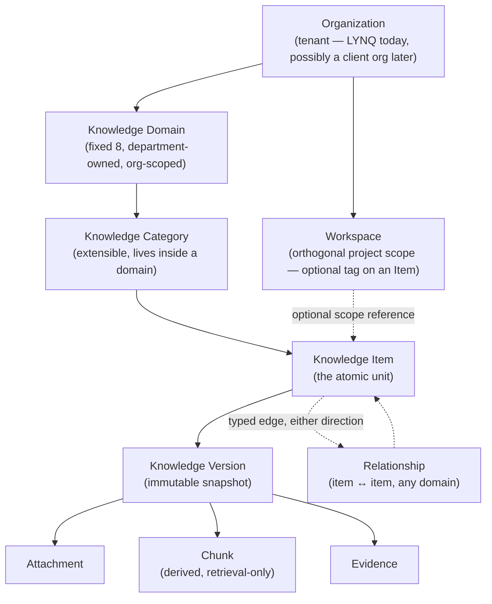
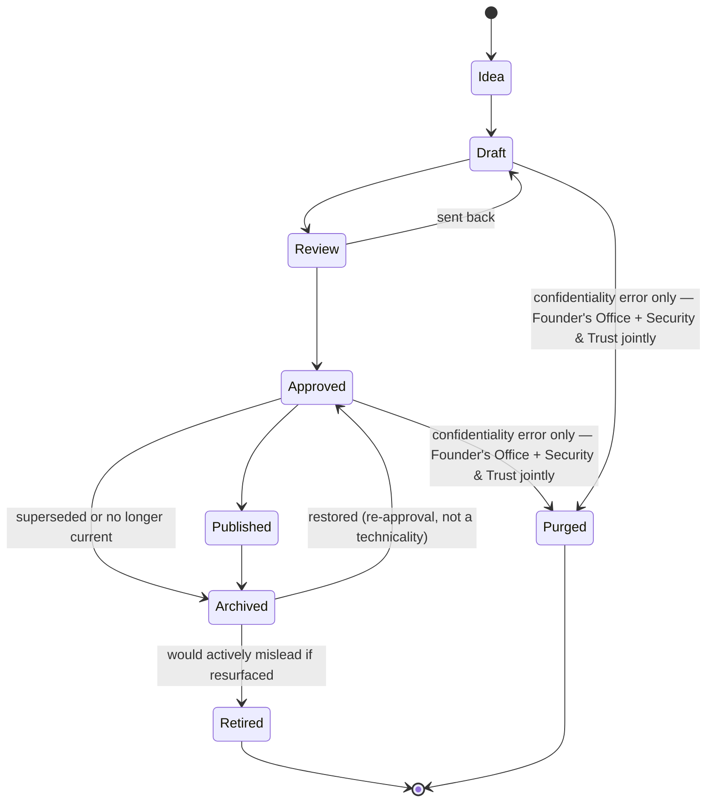
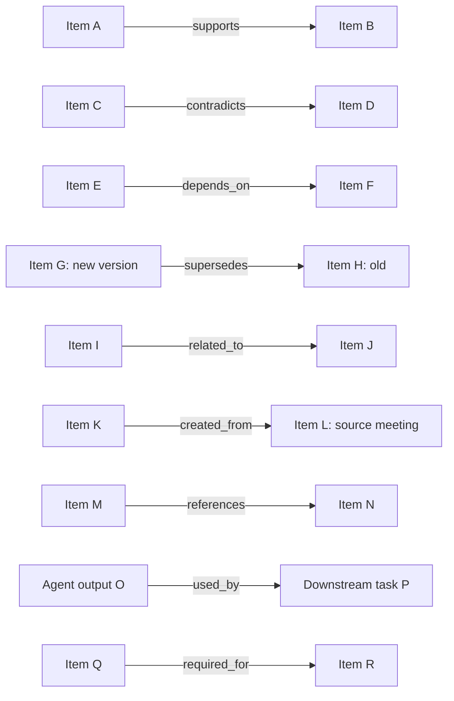
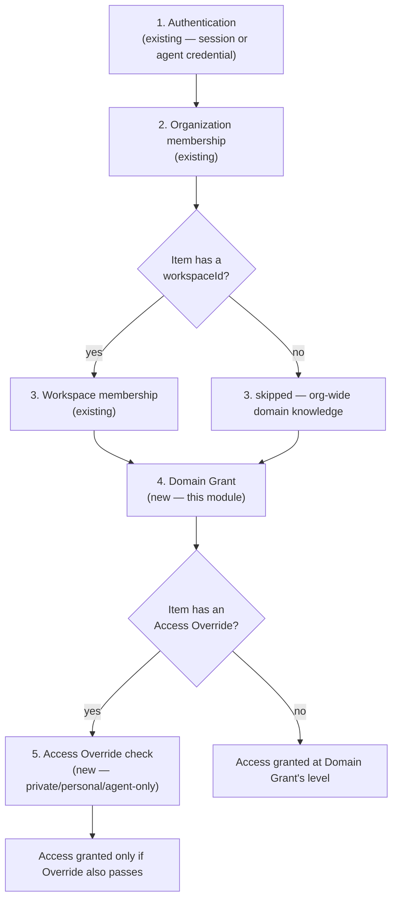
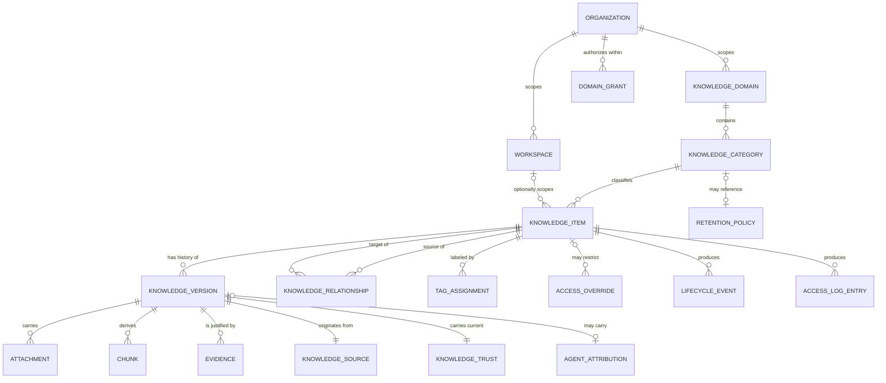

# Module 3 — Brain Architecture Design

**Status: architecture review only. No implementation code, migrations, database tables, APIs, or UI exist yet as a result of this document. Nothing here is built until it is explicitly approved, module by module.**

This document designs the logical architecture of the LYNQ Brain — the company's operating memory, the system every future agent, workflow, and department module (Marketing, Sales, Support, HR, Finance, Operations, Development, CEO, Agents, Workflows) will read from and write into. It does not implement anything. It answers what the Brain *is*, before Module 3's later implementation steps decide how it's built.

---

## 0. Grounding — this is not a new invention

Three documents already define what the Brain is *for*, and this design is deliberately not a departure from them — it is their technical translation:

- **`marketing/LYNQ_BRAIN.md`** — the Brain's purpose, principles, domains, memory model, lifecycle, trust model, source hierarchy, retrieval philosophy, learning system, and agent interaction contract. This document is the *authority* on what the Brain must behave like; this architecture exists to make that behavior implementable without contradicting it.
- **`marketing/AGENT_FRAMEWORK.md`** — how AI agents relate to the Brain specifically: memory access rules, permission levels, and the non-negotiable safety rules an agent operates under regardless of department.
- **`marketing/LYNQ_COMPANY_OS.md`** — the department structure, decision-making framework, and knowledge-architecture principles the Brain's domain ownership model is anchored to.

And one already-shipped module this design must not conflict with:

- **`platform/docs/MODULE_2_AUTH_AND_TENANCY_DESIGN.md`** §12 ("Knowledge ownership boundaries") and §13 ("Non-human identities") — Module 2 already anticipated this module explicitly and left the tenancy model additive-ready for it: a Brain-domain grant is described there as "a fourth, independent gate, layered on top of — never replacing — the existing chain" of authentication → organization membership → workspace membership. This design keeps that promise. **No table Module 2 created changes shape here** — everything below is new, additive schema plus a design for how it composes with what already exists.

Every design decision below is justified against these four documents. Where this document proposes something not already settled by them, it says so explicitly and lists it under §15 (Open Questions) rather than deciding quietly.

---

## 1. Core Concepts

Definitions, not final table names — §13 turns these into logical schema entities.

- **Knowledge Domain** — one of the Brain's fixed, department-owned top-level divisions (LYNQ_BRAIN §3: Identity, Offerings, Market, Execution, Growth, Governance, Capability, Wisdom). The unit domain-level permission grants are scoped to.
- **Knowledge Category** — a finer-grained classification *inside* a domain (e.g., "SOPs" inside Execution). Extensible without Founder-level approval, unlike the domain list itself.
- **Knowledge Item** — the atomic, addressable unit of company knowledge: one thing the company knows, regardless of what kind of thing it is (a policy, a fact, a decision, a summary, a piece of code knowledge). Everything else in this design exists to describe, version, trust, connect, or control access to a Knowledge Item.
- **Knowledge Version** — one immutable snapshot of an item's content and state at a point in time. An item's "current" pointer moves; no version, once written, is ever edited in place.
- **Knowledge Source** — where a version's content actually came from (a named human, a specific registered agent, an import job, an external system, a client statement), carrying the Source Hierarchy rank (LYNQ_BRAIN §7) that resolves cross-tier conflicts.
- **Trust** — the current, explicit confidence tier for a version (LYNQ_BRAIN §6: Verified, Approved, Observed, Hypothesis, Unknown, Deprecated) — distinct from Source, and re-assessed independently of who originally wrote it.
- **Evidence** — a recorded justification for a trust assessment: a citation, a reference to an external document, an observed outcome, a client confirmation. What makes "how trustworthy is this" answerable rather than asserted.
- **Relationship** — a typed, directed edge between two Knowledge Items (supports, contradicts, depends on, supersedes, related to, created from, references, used by, required for).
- **Attachment** — a binary or file asset (image, PDF, recording, design file) associated with a specific version — the Brain's answer to "not everything is text."
- **Chunk** — a derived, machine-generated sub-unit of a version's content, produced for future retrieval only. Never authored directly, never authoritative on its own, always traceable back to exactly one version, and fully regenerable (deleting every chunk for a version and rebuilding them from scratch must always be a safe, lossless operation).
- **Tag** — a free-form, extensible label for cross-cutting retrieval convenience. Deliberately **never** used for authorization — only Domain and Category feed permission grants (see §3, §10).
- **Domain Grant** — an explicit, organization-scoped authorization for a specific person, role, or agent to read, draft-write, approve, archive, or purge within one domain.
- **Access Override** — a narrower, item-level visibility restriction layered on top of a domain grant, for knowledge that is private, personal, relationship-scoped, or agent-only even though its domain is broadly readable.
- **Lifecycle Event** — an immutable, append-only record of a state or trust transition on a specific version — the Brain's contribution to Historical Memory.
- **Access Log** — a separate, high-volume record of *reads* — who or what retrieved which item, when, kept apart from Lifecycle Events for scale reasons (§14).
- **Retention Policy** — a named, reusable rule describing when a category of knowledge should be flagged for expiry review (e.g., "operational client data — review 18 months after project close").
- **Agent Attribution** — the record tying a version's authorship to a specific registered agent identity and that agent's permission level *at the time it wrote*, not its current level.

Deliberately **not** modeled as separate top-level entities, and why: **Fact, Instruction, Policy, Decision, Observation, Summary** are all *kinds* of Knowledge Item, not structurally different things — every one of them needs identical versioning, trust, lifecycle, and relationship machinery. Modeling each as its own table would mean re-implementing the same mechanics five times and would make "what changed" and "what links to what" queries need five near-identical joins instead of one. They are instead values of a `knowledgeType` classification field on Knowledge Item (§3). Summary is the one case worth calling out specifically: an AI-generated summary is itself just a Knowledge Item of type `summary`, carrying a `summarizes` relationship to whatever it condenses — it gets its own trust tier (starting at Hypothesis, like any AI output), its own version history, and is subject to the exact same promotion rules as anything else an agent produces. This is a **major design decision**, revisited in the closing section.

---

## 2. Information Hierarchy

The example hierarchy in the brief (Organization → Workspace → Domain → Item → Version → Attachments → Relationships) nests Domain *inside* Workspace. This design deliberately does not do that, for a concrete reason: LYNQ_BRAIN's domains are department-owned and organization-wide (Governance, for instance, has nothing to do with any one project), while a Workspace in the existing Module 2 model is closer to a specific client engagement or team space — and a single project routinely touches *several* domains at once (a client project is Execution work that also generates Market knowledge about that client and possibly Growth knowledge about how it was won). Forcing Domain under Workspace would mean either duplicating domain knowledge per workspace or picking one arbitrary "owning" workspace for company-wide knowledge, both wrong.

**Recommended hierarchy:**

Workspace is drawn as **orthogonal**, not as a parent of Domain: every Knowledge Item belongs to exactly one Organization and exactly one Domain/Category, and *optionally* also carries a `workspaceId` marking it as project-scoped (LYNQ_BRAIN §4's "Project Memory" scope dimension). A Workspace never owns a domain; it only narrows which items surface as "belonging to this project" on top of whichever domain they already sit in. This is the one place this design deviates from the brief's example ordering, and it is called out again in §15 as worth confirming rather than assumed settled.

---

## 3. Knowledge Taxonomy

**Hybrid, by deliberate design — not fixed, not fully extensible.**

| Level | Mutability | Who can change it | Why |
|---|---|---|---|
| **Domain** (8: Identity, Offerings, Market, Execution, Growth, Governance, Capability, Wisdom) | Effectively fixed | Founder's Office only, and rarely | Domains are the permission boundary (§10) and the department-ownership boundary (Company OS §9–11). Letting them proliferate freely would mean permission grants and department ownership drift out of sync with the org chart. |
| **Category** (e.g. SOPs, Pricing, Client Profiles, Prompts, Architecture) | Extensible | The department owning the parent domain | These are where the brief's long example list (Marketing, Sales, Support, Engineering, Finance, Operations, Legal, HR, Research, Customer, Product, Infrastructure, Prompts, Policies, Procedures, Architecture) actually lives — as categories inside one of the 8 domains, not as thirty flat peers. A new category needs no Founder approval, only the owning department's own decision. |
| **Tag** | Fully free-form | Anyone with write access to the item | Cross-cutting, convenience-only, never used to grant or deny access. A tag answers "what else is this related to for a human browsing," never "who is allowed to see this." |

`knowledgeType` (Fact, Instruction, Policy, Decision, Observation, Summary, SOP, FAQ, Playbook, Template, Prompt, Workflow-definition, Meeting-distillate, and future values) is a **separate, extensible classification** from Category — a `knowledgeType` describes the *shape* of the content (is this a policy statement or a decision record), while Category describes *which department's concern* it is. A Decision can exist in almost any domain; the taxonomy keeps those two questions independent so neither list has to grow to cover the other's job.

---

## 4. Knowledge Lifecycle

This design adopts LYNQ_BRAIN §5's lifecycle exactly, rather than the brief's example list — the brief's list (Draft, Verified, Published, Deprecated, Archived, Deleted, Expired) mixes two different axes that this design deliberately keeps separate: **lifecycle stage** (where something is in its approval workflow) and **trust tier** (how much it should currently be relied on, §5 below). "Verified" and "Deprecated" are trust tiers here, not lifecycle stages.

- **Idea** — unowned, unstructured, anyone or any agent may originate one.
- **Draft** — structured, still untrusted, lives in Working Memory. Agents may write and update freely here (AGENT_FRAMEWORK §4).
- **Review** — a named human is actively evaluating it. Can return to Draft.
- **Approved** — the only stage agents may rely on without hedging. Reaching this stage always requires a human, with no exception for agent permission level (AGENT_FRAMEWORK §4) or founder-originated content (LYNQ_BRAIN §5).
- **Published** — visible beyond the approving department (company-wide, client-facing, or public depending on classification).
- **Archived** — no longer current, deliberately preserved, not deleted. Reversible back to Approved via re-approval.
- **Retired** — would actively mislead if resurfaced; preserved for audit only, excluded from normal retrieval and agent context by default.
- **Purged** — the one genuinely destructive transition, reserved exclusively for the confidentiality-error exception in LYNQ_BRAIN §11 ("knowledge that should never have existed at all"), requiring **Founder's Office and Security & Trust sign-off together**, always. This is not a normal delete path and must never be reachable through routine UI action.

**"Expired" is not a lifecycle stage.** It is a computed condition (an Approved/Published item whose Retention Policy or explicit `expiresAt` has passed) that surfaces a review prompt to the owning department — it never silently transitions an item to Archived on its own. Silent auto-archival of something a human hasn't looked at again is exactly the "quietly forgetting" failure LYNQ_BRAIN §2 Principle 2 exists to prevent.

**Who can transition between states** (mapped onto Company OS §9–11 and LYNQ_BRAIN §11):

| Transition | Authority required |
|---|---|
| Idea/Draft → Review | Any human or agent (draft submission) |
| Review → Approved | A named human with a Domain Grant `approve` level for that domain — for Identity domain specifically, Founder's Office regardless of who owns the sub-category |
| Approved → Published | Same authority as Approved, or an explicitly separate `publish` grant if the department wants publication reviewed by someone other than whoever approved it (deferred decision, §15) |
| Any → Archived | The owning department, `archive`-level grant — reversible, lower bar by design |
| Archived → Approved (restore) | Same authority as original approval — a re-approval, not a technicality |
| Any → Retired | Owning department + explicit reason recorded |
| Draft/Approved → Purged | Founder's Office **and** Security & Trust jointly, always, no exception |

**How changes are audited**: every transition produces a Lifecycle Event (§11) — write-once, never edited, carrying who, what changed, from which state to which, and why.

---

## 5. Trust Model

Distinct from Source (§7) — Trust is *current epistemic status*, reassessed as evidence accumulates, independent of who originally wrote something.

| Tier | Meaning | Agents may... |
|---|---|---|
| **Verified** | Confirmed against an authoritative source beyond reasonable doubt (signed contract, published fact, directly observed outcome) | Act on it without hedging |
| **Approved** | Passed human review (§4), not independently re-verifiable (a stated preference, a strategic call) | Treat as true until explicitly superseded |
| **Observed** | A noticed pattern from real activity, not yet confirmed as a rule | Use to *inform* a suggestion, never assert as fact |
| **Hypothesis** | A reasonable guess, including any AI-generated inference not yet checked | Must flag explicitly as a hypothesis whenever surfaced |
| **Unknown** | An explicit, tracked gap | Report the gap; never fill it with a guess |
| **Deprecated** | Was once a higher tier, has since been superseded | Never used to justify a current action without a human explicitly re-opening it |

**The one rule that matters most** (LYNQ_BRAIN §6, restated as a system invariant this design must enforce structurally, not just by convention): **an agent's stated confidence in its own output can never exceed the trust tier of the knowledge that output was built from.** Structurally, this means every piece of agent output that cites Brain knowledge must carry the *minimum* trust tier across everything it cited — a Verified fact plus a Hypothesis inference produces Hypothesis-confidence output, always, never averaged up.

**Trust propagation rules:**
- Trust is assessed **per version**, not per item — a new version of an item starts back at whatever tier its own review earns; it does not inherit the prior version's trust automatically, though a routine minor edit reviewed by the same authority can be fast-tracked (a process decision, not a schema one).
- Trust **never propagates through a Relationship automatically** — an item `related_to` a Verified item is not itself Verified. The only relationship type with any trust implication is `supersedes`: a superseding version's trust is independently assessed, and the superseded version's trust tier is simultaneously stepped to Deprecated as part of the same transaction.
- A **same-tier conflict** (two Approved items disagreeing) is never resolved by trust math or by an agent picking one — it is escalated to the human who owns that domain, exactly as LYNQ_BRAIN §8 requires, and is itself evidence the Brain has an error needing a fix, not just a query needing an answer.
- **Cross-tier conflict** resolves via Source Hierarchy (§7's rank), not via Trust tier — a Hypothesis from a founder-authored source does not automatically outrank an Observed pattern from an intern's research, but a founder Decision at Approved-tier does outrank an external-research Observed-tier item on the same question, because rank there comes from *source*, not from the trust label alone. These are genuinely two different axes and both must be checked.

---

## 6. Versioning

**Nothing important is ever truly overwritten.** A Knowledge Item's row never contains the actual content — it only ever contains identity, classification, and a pointer to its *current* Version. Every version is immutable once written.

- **Current version** — the item's `currentVersionId` pointer. Moves forward on every accepted edit; is itself a Lifecycle Event.
- **Previous versions** — never deleted, never edited, retained indefinitely (subject only to a Purge, §4, which purges the *item and all its versions* together — there is no such thing as purging one version out of an otherwise-intact history, since a version without its item's context is meaningless and a purge is already the narrow, jointly-authorized exception).
- **Rollback** — implemented as moving `currentVersionId` back to an earlier version's id **plus a new Lifecycle Event recording the rollback and why** — never a destructive undo. The "old" intervening versions remain in history exactly as they were; rollback does not delete them, it just stops pointing at them as current.
- **Diffs** — computed on demand between any two versions of the same item; not stored redundantly, since every version already holds its own full content and a diff is a pure function of two versions.
- **Historical timeline** — the ordered list of every version plus every Lifecycle Event for an item, in one queryable sequence — "who changed what, when, why" directly answerable without reconstructing it from scattered tables.
- **Why** — every version carries a mandatory `changeReason` (free text, required, never optional) distinct from the content itself — a version with no stated reason for existing is treated as an incomplete write, not a valid one.

---

## 7. Relationships

Knowledge is a graph, not a shelf of isolated documents. Every relationship is a **typed, directed edge** between exactly two Knowledge Items (never between two versions directly, and never between an item and a non-Brain entity — see §12 for how the Brain links out to CRM/tickets/etc. via reference identifiers instead).

| Type | Directional meaning | Notes |
|---|---|---|
| `supports` | A strengthens the case for B | Symmetric-feeling but stored one-directional; a reverse `supports` edge can exist separately if genuinely true both ways |
| `contradicts` | A and B cannot both be true as stated | Surfacing a `contradicts` edge between two Approved-tier items is itself a same-tier-conflict trigger (§5) |
| `depends_on` | A requires B to be true/current to make sense | Archiving B should prompt a review of every A that depends on it — a graph-integrity check, not a hard block |
| `supersedes` | A is the newer, authoritative replacement for B | The only relationship type with a trust side-effect (§5) |
| `related_to` | Loose, human-curated association | The default "worth knowing about" edge; carries no authorization or trust implication at all |
| `created_from` | A was derived or distilled from B (e.g., a Decision created from a meeting note) | This is how LYNQ_BRAIN §3's "meetings are events, not knowledge" rule is actually implemented — the raw note can still exist as a reference, linked `created_from` by the Decision that mattered |
| `references` | A cites B as a source without being derived from it | Weaker than `created_from`; used for citations |
| `used_by` | B (often an agent output, task, or workflow run) consumed A as an input | This is the backbone of citation/evidence tracking for agent output (§9) |
| `required_for` | A must exist/be current for B (a process, a deliverable) to be considered complete | Distinct from `depends_on` in direction of obligation — B needs A to exist, rather than A's truth depending on B |

**Design rule enforced structurally, not just by convention:** a relationship can only ever be created between two items the creating actor (human or agent) can currently *see*, and a relationship never grants visibility into the item on its other end — traversing `A --related_to--> B` when the requester cannot independently pass B's own permission check must return nothing for B, never a bypass. This is called out again as a named risk in §14 because it is the single easiest permission-leak vector in a graph-shaped system.

---

## 8. Search Philosophy (not implemented here)

This document does not build search. It states how a *future* search module should be expected to behave, so today's schema doesn't paint that module into a corner.

- **Keyword search** operates over Version content directly (and, for large content, over its Chunks) — the simplest, always-available fallback with no dependency on an embedding pipeline being healthy.
- **Semantic search** operates over Chunk embeddings (an embedding is metadata *about* a Chunk, not a new concept this document needs to introduce structurally — it lives wherever the future search module decides, referenced by `chunkId`). This document does not decide whether that lives in the same Postgres instance (e.g., via `pgvector`) or a dedicated vector store — that is explicitly an open question (§15), not a decision this document is making.
- **Hybrid** — the expected real default: keyword for precision on exact terms (policy names, client names, code identifiers), semantic for recall on conceptual questions, combined with a re-ranking pass.
- **Filters** — Domain, Category, Tag, `knowledgeType`, lifecycle stage, trust tier, and organization/workspace scope must all be available as hard filters *before* ranking — never soft signals a ranking model merely weighs in, since some of these (organization, trust-tier-below-what-the-caller-may-rely-on) are authorization boundaries, not preferences.
- **Permissions** — search must never be allowed to surface an item the requester's Domain Grant / Access Override wouldn't already let them read directly. The permission chain (§10) applies identically whether the request path is "open this item" or "find items about X" — search is a view over the same authorized set, never a separate, looser one.
- **Ranking** should weight, at minimum: text/semantic relevance, **trust tier** (Verified/Approved should generally outrank Hypothesis/Observed for the same relevance score — matching the Retrieval Philosophy's default posture, LYNQ_BRAIN §8), **freshness** (Operational memory should decay in ranking as it ages past what its domain considers current; Permanent/Historical memory should not decay at all), and **usage** (an item frequently retrieved and not since corrected is weak positive signal, not proof).
- **Trust weighting is not optional** — a search that returns a fluent Hypothesis ahead of a dry Verified fact because the Hypothesis happens to embed more closely to the query is reproducing exactly the failure mode LYNQ_BRAIN exists to prevent. Whatever ranking formula is eventually built must treat trust tier as a hard multiplier, not a tiebreaker.

---

## 9. AI Interaction Model

Directly inherited from LYNQ_BRAIN §10 and AGENT_FRAMEWORK §4 — this section states how the schema must support that contract, not a new policy.

- **Read**: broad by default within declared scope — an agent's own department's domain(s), plus Identity always (AGENT_FRAMEWORK §4). Read access is enforced by the same Domain Grant / Access Override chain as a human's (§10) — an agent does not get a separate, looser read path.
- **Write**: only into Draft or Working/Operational-tier content, only within its own declared domain scope. **Never directly to Approved, Published, Permanent, or Historical tiers — no exception for agent permission level, including a hypothetical Executive-tier agent** (AGENT_FRAMEWORK §4, §9). Structurally: the "promote to Approved" transition (§4) must check that the actor is a human identity, not merely that the actor holds a sufficient Domain Grant — permission level and identity type are two separate checks, and both must pass.
- **Approval required**: yes, always, for anything reaching Approved — this is the one gate with literally no bypass anywhere in this design, at any agent permission level, matching AGENT_FRAMEWORK §5's explicit statement that even Executive-tier agents cannot self-promote.
- **Evidence required**: any agent output that asserts a fact, preference, precedent, or past decision must carry `used_by` relationship edges (§7) back to whatever it actually retrieved — an agent output with no evidence trail for a factual claim is treated as a fabrication risk (Company OS Principle 1, AGENT_FRAMEWORK §9 rule 1), not a stylistic gap.
- **Citation requirement**: the same evidence edges double as citations — "where did this come from" must be answerable by traversing `used_by` from the output backward, not by re-asking the agent to explain itself after the fact.
- **Agents create drafts, never published knowledge** — restated because it's the single most load-bearing rule in this whole document: every agent-authored Knowledge Item enters at Idea/Draft, full stop, regardless of how confident the generation process is.
- **Attribution**: every agent-authored version carries an Agent Attribution record (§1) — never disguised as human-authored, matching Module 2 §13's forward-looking `actor_type` note and AGENT_FRAMEWORK §11's logging requirement.

---

## 10. Permissions

Integrates with, never replaces, Module 2's existing chain. A Brain read or write must pass **all** of the following, in order — this is the same "fourth, independent gate" Module 2 §12 already promised, made concrete:

- **Organization visibility** — the outermost boundary; nothing crosses an organization boundary, ever, including relationships (§7) and search results (§8). A future cross-organization template-sharing feature (Company OS §28's SaaS vision) would need its own explicit, separately-designed mechanism — never an accidental byproduct of a loose permission check.
- **Workspace visibility** — applies only when an item is workspace-scoped; unscoped (organization-wide domain) knowledge skips this gate entirely rather than defaulting to some workspace.
- **Private knowledge** — an Access Override restricting an item to exactly one person (or one person plus the agents actively assisting them) — the schema-level version of LYNQ_BRAIN §4's Personal Memory access note ("readable by whoever is actually interacting with that person... not broadcast company-wide by default").
- **Shared knowledge** — the default: no Access Override, visible to everyone with a sufficient Domain Grant for that item's domain.
- **Agent-only knowledge** — an Access Override restricting visibility to non-human identities specifically (e.g., an internal prompt-tuning note that would confuse a human reader but is exactly what an agent needs) — a real, named case, not a hypothetical.
- **Role restrictions** — a Domain Grant's `accessLevel` (read / draft-write / approve / archive / purge) is granted to a specific person, a role, or a specific agent identity — never inherited automatically from organization role (owner/admin/member/viewer) or workspace role (manager/member/viewer) the way Module 2's own memberships are. This mirrors the exact discipline Module 2 already applies to workspace membership itself ("explicit, never inherited") — belonging to the organization, or even the right workspace, is necessary but never sufficient for a Brain-domain grant.

---

## 11. Historical Memory

**Reuses, rather than reinvents, Module 2's existing `audit_logs` pattern** — the same free-text `event_type` column (never a Postgres enum, for the identical reason Module 2 chose that: a new event type should never require a schema migration), the same `{actorUserId, organizationId, targetType, targetId, metadata}` shape, extended with Brain-specific event types (`knowledge_created`, `knowledge_version_created`, `knowledge_state_changed`, `knowledge_trust_changed`, `knowledge_relationship_created`, `knowledge_domain_grant_changed`, `knowledge_purged`).

Two separate logs, deliberately not one, for a scaling reason (see §14):

- **Lifecycle Events** — every *mutation*: version created, state transitioned, trust reassessed, relationship added/removed, grant changed. Low-to-moderate volume, append-only, kept forever, exactly the semantics `audit_logs` already has.
- **Access Log** — every *read* a policy decides is worth recording (at minimum: every read by an agent, since AGENT_FRAMEWORK §11 requires full agent action logging; human reads may be sampled rather than logged at 100% fidelity — an explicit open question, §15). Kept separate specifically so a high-volume, possibly-sampled read log never competes for the same table's performance and retention story as the append-only, never-sampled, never-summarized mutation history.

**What must always be answerable from these two logs together**: who accessed what, who changed what, when, and — for agents specifically — under what permission level and based on which Brain entries (AGENT_FRAMEWORK §11's exact logging requirement). Both logs are themselves Historical Memory: write-once, never edited, only ever appended to.

---

## 12. Future Integrations

The Brain is designed to be the *shared* layer every future module reads from and writes into — no module gets its own private knowledge store that later needs reconciling with this one.

| Module | Reads | Writes (always Draft/Operational, never direct-to-Approved) |
|---|---|---|
| **Marketing** | Growth (its own domain) + Identity (brand consistency) | Campaign performance Observations, content Drafts, positioning Hypotheses |
| **Sales / CRM** | Market (clients, leads, competitive intel) + Offerings (pricing) | Lead/deal notes, qualification Observations, proposal Drafts |
| **Support** | Market (client relationship memory) + Execution (SOPs) | Resolution notes, and — on closing a recurring issue — a Wisdom-domain lesson |
| **Finance** | Governance (pricing, contracts) + Offerings | Invoice/billing Operational state, cost Observations |
| **HR** | Governance (policy) — see §15 for the open question this domain's ownership raises | Personal Memory (with an Access Override) for working-style preferences, Operational state for hiring/onboarding |
| **Developer tools** | Execution (engineering knowledge, architecture) + Capability | Architecture Decisions, incident-derived Wisdom, code-knowledge Facts |
| **Workflow Engine** | Whatever domains the workflow's steps are scoped to, per the same Domain Grant chain as any other caller | Task/step outcomes as Lifecycle Events; any knowledge a step produces enters exactly like any agent's output would |
| **Notifications** | Access Log + Lifecycle Events (subscribes to specific event types) | Nothing — a consumer only, alerting the right domain owner on a same-tier conflict, an expiry flag, or a grant change |
| **Analytics** | Access Log + Lifecycle Events + trust-tier rollups | Nothing directly to the Brain — Brain Health metrics (LYNQ_BRAIN §12) are computed *from* Brain data, not written back into it as knowledge |
| **Agent Registry** (AGENT_FRAMEWORK §14) | Domain Grants + Agent Attributions, to answer "what can this agent actually touch" | Registers new agent identities; itself the source of truth Domain Grants reference when the grantee is an agent rather than a human |

No module in this table gets an exception to §10's permission chain or §9's agent-write rules — "future integration" means *what this module will read and write*, never *a different rulebook*.

---

## 13. Schema Proposal — Logical Entities Only

No SQL, no Drizzle, no migrations. Each entity: purpose, relationships, ownership, lifecycle.

1. **KnowledgeDomain** — *Purpose*: one of the 8 fixed, department-owned top-level divisions, instantiated per organization (an org gets its own copy of the domain list on creation, defaulted to LYNQ's 8, per §15's open question on whether other organizations get to define their own). *Relationships*: belongs to one Organization; contains many Categories; target of many Domain Grants. *Ownership*: Founder's Office (creating/renaming a domain); the mapped department (day-to-day). *Lifecycle*: effectively permanent; a domain is retired, never deleted, if an organization's structure genuinely changes.
2. **KnowledgeCategory** — *Purpose*: extensible sub-classification inside a domain. *Relationships*: belongs to one Domain; classifies many Items; may reference one Retention Policy as its default. *Ownership*: the domain's owning department. *Lifecycle*: created/archived freely by the owning department.
3. **KnowledgeItem** — *Purpose*: the atomic, addressable unit of company knowledge — identity, classification, and a pointer to its current version; never holds content directly. *Relationships*: belongs to one Category (and transitively one Domain, one Organization); optionally references one Workspace; has many Versions; source/target of many Relationships; labeled by many Tags; may have Access Overrides. *Ownership*: whichever human or agent identity created it, until promoted — after Approval, ownership functionally transfers to the owning department. *Lifecycle*: §4 in full.
4. **KnowledgeVersion** — *Purpose*: one immutable snapshot of content + lifecycle stage at a point in time. *Relationships*: belongs to one Item; carries Attachments, Chunks, one Evidence set, one Source, one Trust record, and optionally one Agent Attribution. *Ownership*: the author of that specific version (human or agent). *Lifecycle*: write-once; never edited or deleted except as part of a whole-item Purge.
5. **KnowledgeSource** — *Purpose*: records where a version's content actually originated and its Source Hierarchy rank (LYNQ_BRAIN §7's 9 tiers). *Relationships*: one per Version. *Ownership*: system-recorded at write time, not editable after the fact (correcting a misattributed source requires a new version, not an edit to the source record — consistent with "nothing important disappears, corrections are new entries"). *Lifecycle*: immutable with its version.
6. **KnowledgeTrust** — *Purpose*: the current trust tier assessment (§5) for a version, distinct from Source. *Relationships*: one per Version, may be updated (this is the one entity in the version's "cluster" that is explicitly mutable — trust is *reassessed*, not re-versioned, since re-assessing trust is not the same act as changing content). *Ownership*: whoever holds `approve`-level Domain Grant for that item's domain. *Lifecycle*: changes are themselves Lifecycle Events; the trust record's *current* value can change, but every change it ever had is recoverable from the Lifecycle Event trail, not from the record itself holding history.
7. **Evidence** — *Purpose*: a citation, external reference, observed outcome, or client confirmation justifying a Trust assessment. *Relationships*: many per Version. *Ownership*: whoever performed the verification. *Lifecycle*: append-only; superseding evidence is added, not edited over.
8. **KnowledgeRelationship** — *Purpose*: a typed, directed edge between two Items (§7). *Relationships*: references exactly two Items (source, target) plus a type enum. *Ownership*: whoever created the edge; removable by the same authority that could edit either endpoint item, subject to the same permission chain (§10) on *both* ends. *Lifecycle*: can be removed (a relationship is metadata about the graph, not knowledge content itself — removing a wrong edge is a correction, not a history-erasing act, though the removal is still a Lifecycle Event).
9. **Attachment** — *Purpose*: a binary/file asset tied to a specific version (image, PDF, recording, design file, spreadsheet). *Relationships*: belongs to one Version. *Ownership*: the version's author. *Lifecycle*: immutable with its version; storage location is out of scope for this document (this schema records a reference/pointer, not a storage engine decision).
10. **Chunk** — *Purpose*: a derived, retrieval-oriented sub-unit of a version's content, for future search only. *Relationships*: belongs to one Version. *Ownership*: system-generated, not human-authored. *Lifecycle*: fully disposable and regenerable; deleting all of a version's chunks and rebuilding them must always be safe.
11. **Tag** and **TagAssignment** — *Purpose*: free-form label plus its many-to-many assignment to Items. *Relationships*: a Tag may label many Items; an Item may carry many Tags. *Ownership*: whoever has write access to the item being tagged. *Lifecycle*: freely added/removed, never authorization-bearing (§3).
12. **DomainGrant** — *Purpose*: the explicit, organization-scoped authorization record (§10) — who/what may read, draft-write, approve, archive, or purge within one domain. *Relationships*: references one Organization, one Domain, one grantee (a user, a role, or an agent identity — see §15 on whether this is a closed union or a generic reference). *Ownership*: department lead for that domain (day-to-day grants); Founder's Office for Identity-domain grants specifically. *Lifecycle*: explicit grant/revoke, each a Lifecycle Event; never inferred from organization or workspace role.
13. **AccessOverride** — *Purpose*: a narrower, item-level visibility restriction (private, personal, relationship-scoped, agent-only) layered on top of whatever the Domain Grant would otherwise allow. *Relationships*: belongs to one Item; references the narrower grantee set it restricts visibility to. *Ownership*: the item's author or the owning department. *Lifecycle*: can be added/removed like any other classification; its own change is a Lifecycle Event given its security relevance.
14. **LifecycleEvent** — *Purpose*: the immutable audit record of every mutation (§11). *Relationships*: references one Item (and, where relevant, one Version). *Ownership*: system-recorded, not user-editable, ever. *Lifecycle*: append-only, permanent.
15. **AccessLogEntry** — *Purpose*: the record of a read (§11), kept separate from Lifecycle Events for volume/retention reasons. *Relationships*: references one Item (and, where relevant, one Version) and the reading identity. *Ownership*: system-recorded. *Lifecycle*: append-only; retention window is a policy decision, not necessarily "forever" the way Lifecycle Events are (§15).
16. **RetentionPolicy** — *Purpose*: a named, reusable rule describing when a category of knowledge should be flagged for expiry review. *Relationships*: referenced by many Categories or directly by individual Items that need an exception. *Ownership*: the domain-owning department, or Legal & Compliance for anything with a regulatory retention requirement. *Lifecycle*: versioned like any other policy document would be, though whether a Retention Policy is itself a Knowledge Item (recursive) or a simpler standalone config record is an open question (§15).
17. **AgentAttribution** — *Purpose*: ties a version's authorship to a specific registered agent identity and that agent's permission level at write time. *Relationships*: optional, one per Version (absent for human-authored versions). *Ownership*: system-recorded from the Agent Registry (a Module 3-adjacent, not-yet-built system this design assumes will exist, per AGENT_FRAMEWORK §14). *Lifecycle*: immutable with its version. **Delivered (Brain Module 17) as paired columns, not a standalone table**: `knowledgeItems.authorAgentId`/`authorType` and `knowledgeItemVersions.createdByAgentId`/`createdByType`, mutually exclusive with their `*UserId` siblings via a database CHECK constraint, rather than a separate `AgentAttribution` entity — the smaller, robust model this task's own instruction favored, scoped only to the tables an agent can actually write under the current Draft-only ceiling. "Agent's permission level at write time" is NOT separately captured on the attribution itself (the Agent Registry's own `agent_versions` table already records permission-level history per agent, addressable by timestamp if ever needed) — see `platform/docs/MODULE_5_BRAIN_MODULE_17_AGENT_ATTRIBUTION.md`.

---

## 14. Risks

- **Performance risk — Chunk volume.** If every version of every item generates dozens of chunks for future semantic search, chunk-table row count grows far faster than the Item/Version tables themselves. Mitigated by treating chunks as fully disposable/regenerable (§13) so at least storage bloat is recoverable, but the *write* volume at scale is a real concern for whichever module eventually builds indexing.
- **Scaling risk — Access Log volume**, especially once agents are reading the Brain constantly (AGENT_FRAMEWORK §11 requires logging every agent action). Full-fidelity logging of every agent read, at hundreds-of-agents scale (AGENT_FRAMEWORK §18's stated future), could dwarf every other table combined. This is why Access Log is architecturally separate from Lifecycle Events (§11) — but the retention/sampling policy itself is an open question (§15), not yet solved by separating the tables alone.
- **Scaling risk — version history growth on high-churn Operational items.** An item updated frequently (e.g., a live deal's status) could accumulate a version per change indefinitely. Nothing in this design deletes old versions, by principle — but a high-churn item may need a "collapse old minor versions into a periodic snapshot" strategy eventually, which would be a policy layered on top of this schema, not a change to it.
- **Security risk — relationship traversal as a permission-leak vector** (flagged already in §7): any query that follows a Relationship edge must re-check the target item's full permission chain independently. The single most likely place a future implementation accidentally leaks cross-tenant or cross-domain data is a "show me related items" feature that forgets this.
- **Security risk — cross-organization leakage.** Every entity in §13 scopes to exactly one Organization at the root. A Relationship, in particular, must be structurally prevented from ever connecting items in two different organizations — this needs to be as hard a constraint as Module 2's own composite-foreign-key trick that makes a workspace/organization mismatch physically unrepresentable in the database, not just an application-level check.
- **Knowledge poisoning risk.** A compromised or misconfigured agent credential, or a bad bulk import, writing large volumes of confidently-worded Draft content is the realistic poisoning vector here — mitigated structurally by "agents can never write above Draft" (§9) and by Source/Agent Attribution making the origin of a suspicious spike immediately traceable, but a *volume* anomaly (a thousand new Drafts in an hour from one agent) needs its own monitoring, which is out of this document's scope but should exist before agents are writing at real scale.
- **Hallucination risk.** An agent asserting something as fact when the underlying knowledge was Hypothesis-tier is the single most-cited failure mode across all three grounding documents. Mitigated structurally by the confidence-cannot-exceed-source-trust rule (§5, §9) and mandatory evidence edges (§9) — but this is a rule the schema can only *support*; it cannot mechanically prevent an agent from simply not citing anything and asserting freely. Enforcement ultimately depends on whichever system prompts/guards the actual agent runtime, which is out of this document's scope.
- **Permission leak risk beyond relationships** — search (§8) and any future "similar items" or recommendation feature are the other obvious places a looser, "helpful" code path could bypass the real permission chain. The rule stated in §8 (search is a view over the same authorized set, never a separate looser one) needs to be treated as load-bearing wherever it's implemented, not just documented here.
- **Version conflict risk.** Two concurrent edits to the same item (a human and an agent, or two humans) racing to become the "next" version is a real concurrency case this design does not yet resolve mechanically — it states that a same-tier conflict escalates to a human (§5, §8) but doesn't yet specify the low-level concurrency primitive (optimistic locking on `currentVersionId`, most likely) that would actually implement that. Flagged for the implementation phase, not decided here.
- **Agent conflict risk.** Two agents producing contradicting Draft-tier output about the same item is lower-severity than a same-tier Approved conflict (neither is authoritative yet), but if unmonitored it could mean a reviewing human faces a pile of contradicting drafts with no signal about which to trust — Observability's "escalation frequency" and "consistency" metrics (LYNQ_BRAIN §12, AGENT_FRAMEWORK §12) are the intended early-warning signal, not a schema-level fix.

---

## 15. Open Questions

Every one of these is a real architectural fork this document deliberately does not resolve — each needs an explicit decision before or during implementation, not a silent default.

1. **Is the 8-domain list fixed forever, or organization-configurable?** This design assumes LYNQ's own 8 domains are the default for every organization, but Company OS §28's Future SaaS Vision implies a *different* company, with a *different* department structure, might eventually use this same Brain. Does a client organization get to define its own domain set, or is the 8-domain model itself part of what LYNQ is selling (i.e., intentionally not configurable)?
2. **Domain-to-department ownership mapping.** LYNQ_BRAIN §11 requires exactly one owning department per domain, but Company OS's 13 departments don't map cleanly 1:1 onto the 8 domains (Offerings touches both Product and Design; Market touches both Sales & BizDev and Research & Strategy; Governance touches Legal & Compliance, Finance & Operations, and Security & Trust; and Wisdom has no obvious single owner at all). A proposed mapping is sketched in §12's table by necessity, but it is **not confirmed** and needs an explicit Founder's Office decision.
3. **Where does HR fit?** The brief's Module 3 prompt lists HR as a future consumer of the Brain, but Company OS's current org chart (§9–11) does not list HR as a department at all. Is HR folded into Finance & Operations for now, does it need to be added to the Company OS's own department list first (a Module 2/Company-OS-level decision, not a Brain-level one), or does it get provisional Governance-domain access without a dedicated owning department?
4. **Is Summary really just a `knowledgeType`, or does it need its own structural treatment?** This document recommends folding it into Knowledge Item (§1) for consistency with every other content shape, but a summary's relationship to *many* source items (rather than one) via `summarizes` edges could get unwieldy at scale if a summary needs to summarize hundreds of items — worth revisiting once a real volume of summaries exists.
5. **Publish as its own gate, separate from Approve?** §4 leaves open whether "Approved → Published" always uses the same authority as approval itself, or whether some domains want a distinct `publish`-level grant (e.g., Legal approves internally, but Marketing & Brand controls what actually goes public).
6. **Full-fidelity vs. sampled human Access Log.** Agent reads must be logged at 100% fidelity (AGENT_FRAMEWORK §11 has no sampling exception) — but is the same true for every human read, or is human read-logging sampled/aggregated for volume reasons? This is a real storage-cost-vs-completeness tradeoff, not a settled one.
7. **Where do Chunks and their embeddings actually live?** This document deliberately does not decide between an in-Postgres vector extension, a dedicated vector database, or a hybrid — that decision belongs to whichever future module actually builds search (§8), informed by real volume once the Brain has real content in it.
8. **Is DomainGrant's grantee a closed union (user | role | agent) or a generic reference?** Module 2's own tenancy design explicitly deferred a generic "principals" abstraction (§0's grounding, referencing Module 2 §13) in favor of the simplest safe path until a second non-human identity type actually existed. The Brain's DomainGrant needs the same judgment call made explicitly, now that "agent" is a second, real grantee type from day one of this design (unlike Module 2, which had zero non-human identities at the time).
9. **Retention Policy: is it itself a Knowledge Item, or a simpler standalone config record?** Modeling it as a Knowledge Item would give it versioning/trust/audit "for free," consistent with §1's stance that named policies are just a `knowledgeType` — but it may be over-engineered for what is, in practice, a short list of simple rules that rarely change.
10. **What happens to Workflow Engine-authored knowledge specifically?** §12 treats Workflow Engine as producing knowledge "exactly like any agent's output would," but a workflow run is often a *composite* of several agents' work — does the resulting Knowledge Item get one Agent Attribution (the workflow itself, treated as its own identity) or does it need to preserve attribution for each contributing step? Not resolved here.
11. **Does a relationship removal require the same authority as creating one, or is it always more permissive (since removing a wrong edge is a correction)?** §13 assumes symmetric authority; this may be too strict for quick corrections of obviously-wrong edges versus too loose for removing an edge that itself has evidentiary weight (e.g., a recorded `contradicts` edge that's part of an active dispute).
12. **Exact interaction between Workspace-scoped items and Domain Grants** — if an item is both Execution-domain and scoped to the "Finding Amy" workspace, does a person need *both* a Workspace membership *and* an Execution Domain Grant to read it (this document's assumption, per §10's gate chain), or should a sufficiently-privileged Domain Grant alone be enough to bypass the workspace check for domain-wide readers? The gate-chain diagram in §10 assumes both are always required when both apply; this deserves explicit confirmation since it affects how restrictive project-scoped knowledge actually is in practice.

---

## Deliverables

### Executive summary

The Brain is designed as an additive extension of Module 2's existing tenancy model — nothing already shipped changes shape. Its core unit is the **Knowledge Item**: a classified, versioned, trust-rated, relationship-capable record that can represent any of the many content shapes the company needs (SOPs, policies, decisions, facts, summaries, prompts, and more) without a proliferation of near-identical tables. Knowledge is organized into 8 fixed, department-owned **Domains** (per organization), with extensible **Categories** underneath and free-form **Tags** alongside — a deliberate hybrid taxonomy. Every version of every item carries an explicit **Trust** tier and **Source**, kept as two independent axes, so "how confident should I be" and "who said so" are never conflated. Nothing is ever deleted in the normal course of operation — only archived, retired, or (in one narrow, jointly-authorized case) purged — and every mutation produces a permanent, append-only Lifecycle Event. AI agents read broadly within their scope and Identity, but can never write above Draft tier and can never self-promote to Approved, regardless of permission level — a rule enforced structurally, not just by convention. Access is gated by a four-step chain (authentication → organization → workspace where applicable → domain grant → item-level override), with domain-level authorization never inherited automatically from organization or workspace role, matching the "explicit, never inherited" discipline Module 2 already established for workspace membership itself.

### Major design decisions

1. **Content-shape variety (Fact/Policy/Decision/Summary/etc.) is a classification field on one Knowledge Item entity, not separate tables per shape.** Rejected the alternative (a table per content type) because it would multiply the versioning/trust/relationship machinery five-plus times over for no behavioral difference between the shapes.
2. **Trust and Source are modeled as two independent entities/axes, not one.** Source answers "what kind of origin is this" (used for cross-tier conflict resolution); Trust answers "how much should this currently be relied on" (reassessed independently of origin, tied to lifecycle review). Conflating them would make it impossible to represent "a founder-originated idea that hasn't been reviewed yet" versus "a reviewed, Approved fact," which are very different things.
3. **Workspace is modeled as an orthogonal, optional scope on a Knowledge Item, not a parent of Domain**, deviating from the brief's example hierarchy. Domains are org-wide and department-owned; workspaces are project-scoped and routinely cut across multiple domains at once. Nesting domains inside workspaces would force either duplication or an arbitrary "owning workspace" for company-wide knowledge.
4. **Lifecycle stage and Trust tier are kept as two separate axes**, rejecting the brief's example list (which blended Draft/Verified/Published/Deprecated/Archived into one list). LYNQ_BRAIN §5 and §6 already treat these separately; this design preserves that rather than collapsing them for schema convenience.
5. **"Expired" is a computed condition that triggers human review, never an automatic state transition.** An item silently auto-archiving because a retention window passed is the "quietly forgetting" failure LYNQ_BRAIN explicitly exists to prevent.
6. **Purge is a single, narrow, jointly-authorized terminal state**, structurally distinct from Archive/Retire, reserved for the one case LYNQ_BRAIN §11 actually permits real deletion (a confidentiality error) — requiring Founder's Office and Security & Trust together, with no other path to the same outcome.
7. **Two separate audit logs (Lifecycle Events vs. Access Log), not one**, purely for the scaling reason that read-volume (especially from agents) will vastly outpace mutation volume, and the two have different retention/completeness needs.
8. **Domain-level authorization is never inherited from organization or workspace role.** A Domain Grant is its own explicit record, matching the "explicit, never inherited" philosophy Module 2 already applies everywhere else in its tenancy model.
9. **Relationships connect Items, never Versions**, and are structurally required to re-check both endpoints' full permission chain on every traversal — named as the single easiest permission-leak vector in this whole design (§7, §14).

### Alternative designs considered

- **A generic, fully-normalized "principals" abstraction for grantees (user/role/agent) from day one**, instead of the closed-union approach this document leans toward. Rejected for now on the same grounds Module 2 itself already used to defer this exact abstraction (§0 grounding) — though flagged as a real open question (§15.8) rather than fully closed, since "agent" is a genuine second identity type from this module's very first version, unlike Module 2's situation.
- **Modeling each `knowledgeType` (Fact, Policy, Decision, Summary, SOP, ...) as its own table**, considered and rejected in favor of one Knowledge Item entity with a classification field (§1, major decision 1) — the alternative was seriously drafted before being rejected, specifically because it initially seemed like it would make each type's specific fields cleaner, but the versioning/trust/relationship duplication cost was judged not worth it.
- **Nesting Domain inside Workspace, matching the brief's example hierarchy literally.** Considered and rejected (§2, major decision 3) because it doesn't reflect how domains and workspaces actually relate in practice (org-wide department ownership vs. project-scoped cross-cutting work).
- **A single unified audit log for both mutations and reads.** Considered and rejected (major decision 7) purely on the volume/retention mismatch between the two once agents are reading constantly.
- **Automatic trust propagation through relationships** (e.g., an item related to several Verified items automatically climbing toward Verified itself). Considered and explicitly rejected (§5) — this is exactly the kind of silent-confidence-inflation mechanism the grounding documents warn against; trust is earned per version, through review, never inferred from a item's neighbors in the graph.

### Tradeoffs

- **Simplicity vs. specialization**: collapsing all content shapes into one Knowledge Item entity (decision 1) trades some type-specific schema cleanliness for a single, consistent set of mechanics — the right tradeoff at this stage, revisitable if one `knowledgeType` genuinely needs structurally different fields later (an additive migration, not a redesign).
- **Completeness vs. cost of the Access Log**: full-fidelity read-logging is the safest default but the most expensive at scale (§14); this document does not resolve that tradeoff (§15.6) because it depends on real volume data this system doesn't have yet.
- **Strictness vs. friction in the permission chain**: requiring both Workspace membership *and* a Domain Grant for workspace-scoped items (§10, §15.12) is the more secure default but could prove overly restrictive for a domain-wide reader who has every right to see project knowledge in their own domain — flagged rather than silently resolved either way.
- **Reusability vs. simplicity for Retention Policy** (§15.9): modeling it as a full Knowledge Item gives it audit/versioning for free but may be heavier than warranted for what could be a short, rarely-changing rule set.

### Open questions

See §15 in full — twelve distinct architectural forks, none silently decided, all requiring explicit sign-off (mostly Founder's Office, several jointly with Security & Trust or whichever department eventually builds search/indexing) before or during implementation.

### Recommended implementation order

Each step below is intended to be its own small, independently verifiable module-step commit, following the same discipline every prior module in this codebase has used — **none of this is authorized to begin until this document itself is approved**:

1. **Core entities first, no trust/versioning yet**: Organization-scoped KnowledgeDomain, KnowledgeCategory, and a minimal KnowledgeItem + single-version-only KnowledgeVersion (no history yet) — enough to prove the domain/category/item shape end-to-end before adding complexity.
2. **Versioning and Source**: real immutable version history, `currentVersionId`, rollback, diffs, and the Source record — proves "nothing important disappears" before Trust is layered on.
3. **Trust and Evidence**: the six-tier model, propagation rules, same-tier-conflict detection (surfacing, not auto-resolving).
4. **Lifecycle states and transitions**: the full Idea→...→Purged state machine with authority checks per transition, and the Lifecycle Event log.
5. **Permissions**: DomainGrant and AccessOverride, wired into the existing organization/workspace chain — the module this whole design has been building toward, and the one that must exist before any real content is entered, not after.
6. **Relationships**: the typed edge model, with the permission-re-check-on-traversal rule enforced from its very first version, not retrofitted.
7. **Attachments, Tags, Chunks (structural only, no search yet)**: file references, free-form tagging, and disposable/regenerable chunk records — chunk *generation logic* and any embedding pipeline remain explicitly out of scope until a dedicated search module is separately approved.
8. **Access Log**, separate from Lifecycle Events, with whatever sampling policy gets decided (§15.6) implemented from the start rather than added after volume becomes a problem.
9. **Agent Attribution and the first real Domain Grants for a non-human identity** — deliberately sequenced *after* permissions and lifecycle are proven solid with humans only, so the first agent write ever recorded is going through a chain that's already been exercised, not one that's being tested for the first time by an agent.
10. Everything in §12 (Marketing, Sales, Support, Finance, HR, Developer tools, Workflow Engine, Notifications, Analytics, Agent Registry integration) follows only after steps 1–9 are individually shipped and verified — this document takes no position on which of those modules goes first, since that's a product/business sequencing decision, not an architectural one.

---

*This document is an architecture review. No Brain implementation code, migration, table, API, or UI has been created as a result of it. Implementation begins only after explicit approval of this design, module-step by module-step, per the order above.*
