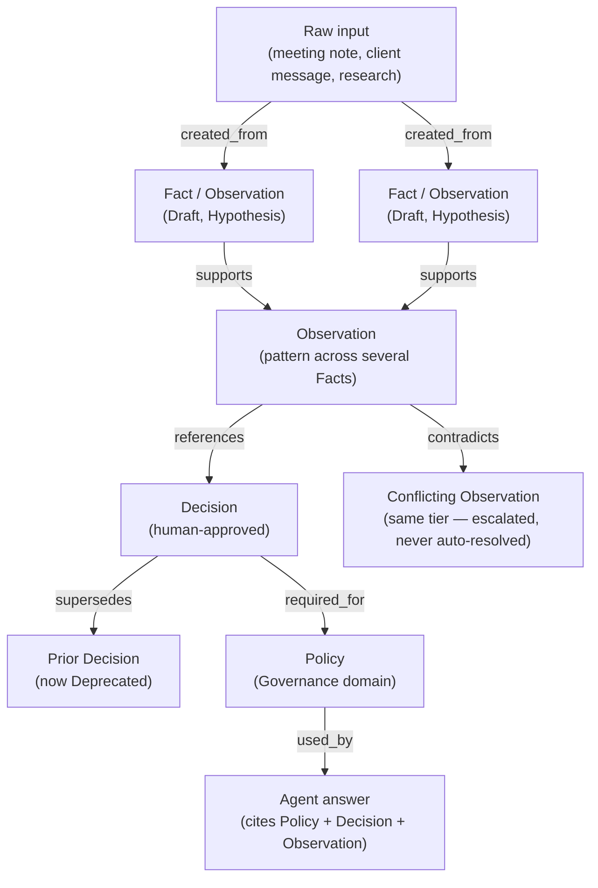
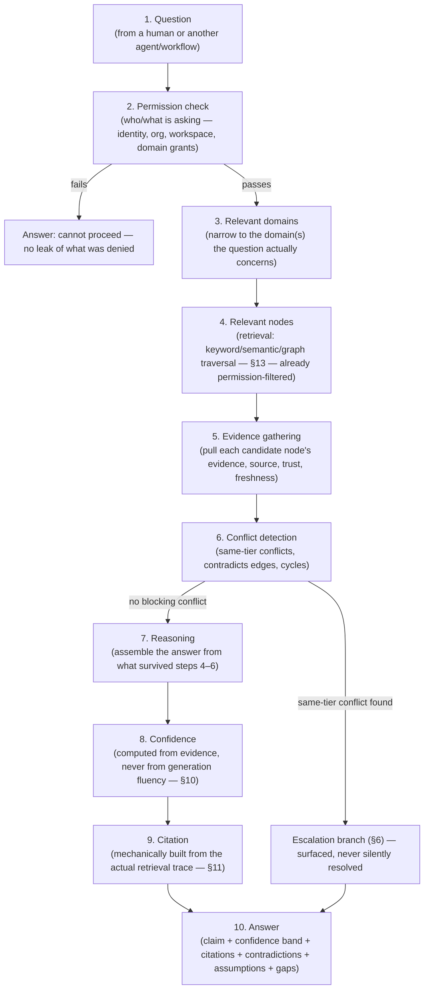
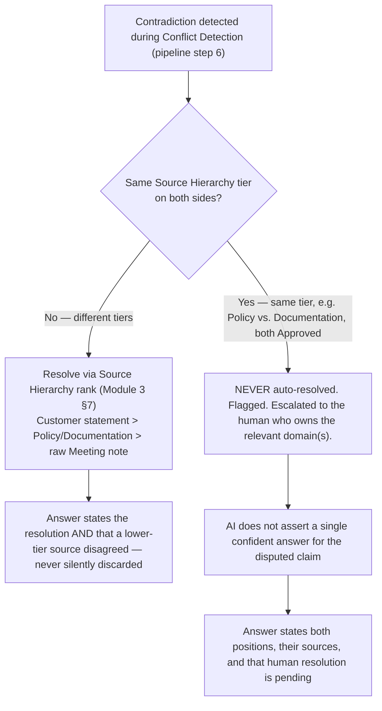
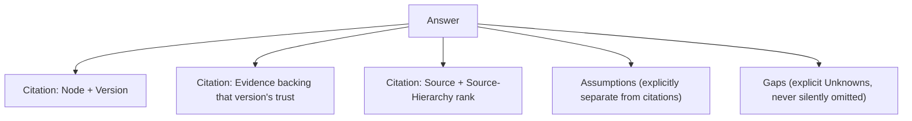

# Module 3.1 — Brain Graph & Reasoning Engine Architecture

**Status: architecture review only. No implementation code, migrations, database tables, APIs, or UI exist yet as a result of this document. Module 3 (`platform/docs/MODULE_3_BRAIN_ARCHITECTURE.md`) is not modified — this document builds on it, strictly additively, and defers to it on every point of storage schema.**

Module 3 designed what the Brain *stores*. This document designs how that stored knowledge becomes *understanding* — the reasoning layer every future AI agent inherits, regardless of department. The Brain Graph described below is a **logical, conceptual view over Module 3's existing entities** (Knowledge Item, Version, Relationship, Evidence, Trust, Source) — not a new storage engine, not a graph database, not a second copy of the Brain's data. Reasoning is a way of *traversing and evaluating* what Module 3 already defines, never a parallel system that needs reconciling with it.

---

## Goals

The AI never simply "answers." Every substantive response is expected to make these explicit, every time, not on request:

- **Why** it believes something — the reasoning chain, not just the conclusion.
- **What evidence** supports it — traceable to real Brain entries, never asserted.
- **How trustworthy** it is — a stated confidence band, derived from the evidence, never from how fluent the answer sounds.
- **Which knowledge was used** — a citation list, not a vague "based on internal information."
- **What contradicts it** — if anything does, surfaced, never hidden.
- **What assumptions exist** — anything the reasoning filled in that the Brain didn't explicitly state.
- **What information is missing** — an honest gap, stated as a gap.

**Transparency is preferred over confidence, structurally, not as a style guideline.** An answer that is less impressive but fully explainable is the correct output of this system; an answer that sounds more certain than its evidence justifies is a defect, not a feature, regardless of how satisfying it would be to read.

---

## 1. The Brain Graph

The Brain, viewed for reasoning purposes, is a directed graph:

- **Nodes** are Knowledge Items (Module 3 §1, §13) — always resolved to a specific Version for reasoning (the current version by default; a specific historical version when reasoning about "what did we believe at time T," e.g. reconstructing why a past decision was made). A node without a resolved version is not usable in reasoning — identity alone (an Item with no readable version) carries no content to reason over.
- **Edges** are Knowledge Relationships (Module 3 §7) — `supports`, `contradicts`, `depends_on`, `supersedes`, `related_to`, `created_from`, `references`, `used_by`, `required_for` — plus one reasoning-time-only edge kind that is never persisted as a Relationship: a **citation edge**, generated fresh by each reasoning run linking an answer to the specific nodes it actually used (§11). Citation edges are the reasoning layer's own bookkeeping, not new Brain schema.
- **Evidence** attaches to a node's version (Module 3 §1, §13), not to an edge — an edge says two things are connected and how; evidence says why a specific version deserves the trust tier it currently carries. Reasoning treats a node's evidence as what justifies *using* it, and an edge as what justifies *connecting* it to something else.
- **Domains** partition the graph at the outermost level (Module 3 §2 — one of the 8 fixed domains, per organization). A reasoning run's very first move (§2 below) is narrowing to the relevant domain(s) before touching any node — domains are a hard filter on the graph, not a soft grouping.
- **Versions** are what makes the graph time-aware: the same Item can be a different node in effect depending on which version is resolved. Reasoning about "what changed" walks the version chain of one node; reasoning about "what do we currently know" always resolves to current versions unless explicitly asked to look back.
- **Relationships** are what make the graph a graph rather than a shelf of independent facts — the mechanism by which one piece of knowledge's trustworthiness, freshness, or relevance is allowed to inform reasoning about another, without ever silently propagating trust itself (Module 3 §5 — an edge is a path to *check*, never a path that transmits confidence automatically).
- **Ownership** — every node belongs to exactly one Domain, and transitively to the department that owns it (Module 3 §12, §15.2). Ownership matters to reasoning in one specific way: when reasoning surfaces a same-tier conflict or a data-quality anomaly (a cycle, a stale Operational fact), the escalation target (§6, §9) is always the owning department of the node in question — ownership is what makes "ask a human" resolve to a *specific* human, not a broadcast.

**How knowledge flows** through this graph, conceptually:

Knowledge does not flow "up" a rigid ladder — it flows along whatever relationships are actually true. A single Decision might rest on one Observation and three references; a Policy might be required_for several Decisions across different domains (Governance content routinely constrains Growth or Execution decisions). The graph shape is discovered per question, not fixed per domain.

---

## 2. Reasoning Pipeline

Expanding the example flow into a complete, ordered pipeline. Every step is a hard gate — a later step never runs on data that failed an earlier one, and no step is ever skipped for convenience.

**Step-by-step detail:**

1. **Question** — arrives with the identity of whoever is asking (a human session, or an agent's own identity + declared scope, per Module 3 §9). A question with no attached identity cannot enter the pipeline at all — there is no anonymous reasoning path.
2. **Permission check** — runs *before* any node is fetched, as a hard pre-filter on the retrieval query itself (§9) — never a post-hoc filter applied to results after the fact. Checks authentication → organization → workspace (if scoped) → domain grant → access override, exactly the chain Module 3 §10 defines. A failed check produces a generic "cannot proceed" — it never reveals *what* was denied, since that itself can leak the existence of restricted knowledge.
3. **Relevant domains** — narrows the graph to the domain(s) plausibly relevant to the question, using the question's own content plus the asking agent's declared scope (its own department's domain + Identity, per AGENT_FRAMEWORK §4) as a hard upper bound — an agent never reasons outside its declared scope even if the retrieval step could technically find something there.
4. **Relevant nodes** — retrieval proper (§13): keyword, semantic, and graph-traversal candidates, unioned, already filtered to what survived step 2's permission gate. This step returns *candidates*, not answers — presence in this list means "plausibly relevant," never "true."
5. **Evidence gathering** — for every candidate node, pull its current Trust tier, Source (and Source Hierarchy rank), Evidence set, and freshness signal (§7). This is the step that turns a bag of plausible nodes into a bag of *evaluable* ones.
6. **Conflict detection** — checks the gathered set for `contradicts` edges among them, for same-tier disagreement even without an explicit edge (two Approved nodes asserting incompatible things that were never formally linked), and for graph cycles encountered during traversal (§9). Any same-tier conflict or unresolved cycle branches to escalation — this step can *stop* the pipeline from producing a confident single answer; it never quietly filters the conflict out and continues.
7. **Reasoning** — assembles the actual answer from whatever passed steps 4–6: which nodes to draw from, how they combine, what if anything must be stated as an assumption because the Brain didn't explicitly cover it. Cross-tier disagreement is resolved here via Source Hierarchy (Module 3 §5, §7) — resolved, not ignored, and the resolution itself (which source won and why) becomes part of the answer's explanation, not a hidden internal step.
8. **Confidence** — computed per §10, from the evidence actually gathered in step 5, never from how certain the underlying generation process "feels."
9. **Citation** — built mechanically from the literal set of nodes/versions/evidence actually used in steps 5–7 — never regenerated from the finished answer text after the fact (§11).
10. **Answer** — the claim, its confidence band, its citations, any contradictions surfaced (even if resolved via Source Hierarchy — the fact that a contradiction existed is itself disclosed), any assumptions made, and any gaps ("the Brain has no information about X") stated plainly rather than smoothed over.

---

## 3. Evidence Model

Evidence (Module 3 §1, §13) is what justifies trust in a specific version — this section designs how reasoning classifies and weighs it, which Module 3 left to the reasoning layer by design.

| Evidence class | Definition | Reasoning treatment |
|---|---|---|
| **Primary** | A direct, authoritative record of the fact itself — a signed contract, a client's own explicit statement, a directly observed outcome | Can justify Verified-tier reliance on its own; the strongest single evidence class |
| **Supporting** | Corroborates a claim without being the authoritative record itself — a second meeting note agreeing with the first, an internal document restating a known policy | Raises confidence when it agrees with Primary or other Supporting evidence; does not independently establish Verified-tier trust |
| **Weak** | Plausible but thin — a single unconfirmed mention, an inference with no corroboration, an old data point never revisited | Can support a Hypothesis or Observed-tier claim; should never be presented as though it carries more weight than that, no matter how confidently it's phrased in the source |
| **Historical** | Evidence about what was *believed or true in the past*, explicitly not a claim about the present — a prior decision's rationale, an archived policy's stated reasoning | Valid and often essential for explaining *why* something is the way it is now, but must never be cited as evidence for a *current* claim without an explicit note that it's historical context |
| **Conflicting** | Evidence that contradicts other evidence for the same claim | Never averaged away or silently dropped — its existence is itself part of the answer (§6); conflicting evidence lowers confidence even when one side "wins" via Source Hierarchy |
| **Missing** | The explicit absence of evidence for a claim the question actually needs answered | Treated as a first-class, valuable output (an "Unknown," LYNQ_BRAIN §6) — never silently papered over by generating a plausible-sounding but unevidenced answer |

**Does evidence have trust?** Yes — independently of the trust tier of the version it supports. A piece of Primary evidence can itself later be found wrong (a "signed contract" reference that turns out to be a draft, never executed); evidence trust is reassessed the same way a version's trust is (Module 3 §5), and a downgrade in evidence trust is itself a trigger to re-review whatever version relied on it.

**Does evidence expire?** Yes, for the same reason knowledge does (§7) — evidence tied to a specific moment (an observed outcome, a client statement) doesn't become false, but its *relevance* to a present-tense claim decays, especially for Operational-stability content. Evidence itself is never deleted (matching the Brain's "nothing important disappears" principle); it is marked stale and weighted down accordingly, never removed from the record.

**How is evidence ranked** for a given claim? By, in order of weight: evidence class (Primary > Supporting > Weak), Source Hierarchy rank of its origin (Module 3 §7), independence from other evidence already counted (two mentions of the identical single meeting are not two pieces of corroboration — see §10's "correlated vs. independent" note), and freshness. Ranking determines which evidence gets foregrounded in an explanation, not which evidence exists — even low-ranked evidence remains visible in the full citation trail (§11) if asked for.

---

## 4. Observations

Using the brief's own example: three separate meeting-derived items each recording one customer's request for feature X are **not**, on their own, an Observation — they are three Facts. An Observation is the distinct, higher-level claim that a *pattern* exists across them ("enterprise customers frequently request feature X").

- **When created**: when enough independently-sourced lower-level items (Facts, meeting distillates, support tickets) point the same direction that the pattern itself is worth stating as its own piece of knowledge — not on the first mention, and not by rigid count alone, since three mentions from the same client relationship is a different (weaker) signal than three mentions from three unrelated clients (an independence concern, same as §3/§10).
- **Who creates them**: a human (typically the domain-owning department — here, Product or Research & Strategy) noticing the pattern directly, or an agent proposing one as a Draft — an agent-authored Observation is exactly as permitted as any other agent Draft (Module 3 §9) and enters at Hypothesis trust, never higher, regardless of how many source items it cites.
- **How verified**: promoted from Hypothesis toward Observed as its supporting evidence set grows and stays uncontradicted; promoted to Approved only through the normal human-review lifecycle gate (Module 3 §4) — meaning a human has looked at the underlying Facts and agreed the pattern is real and worth relying on, not merely repeated often. **An Observation's natural ceiling is Approved, not Verified** — Verified requires confirmation "beyond reasonable doubt" against an authoritative source, and a pattern-across-instances claim is structurally a different kind of claim than a single verifiable fact; treating an Observation as Verified would misrepresent what kind of knowledge it actually is.
- **How they evolve**: new supporting Facts strengthen it (new `created_from`/`supports` edges); a contradicting instance (an enterprise customer explicitly *not* wanting feature X) attaches as a `contradicts` edge and forces a re-review, not a silent average; the Observation's own version is updated (a new version, old one retained) as its evidence set materially changes, each carrying a `changeReason`.
- **How they expire**: Observations are typically Operational-stability, Market- or Growth-scope memory (Module 3 §2's memory dimensions) and should carry a review-date/Retention Policy reference (§7) proportional to how fast that market segment actually changes — an Observation about enterprise feature demand from two years ago is a candidate for review, not a permanent truth, even if never formally contradicted.

---

## 5. Decisions

Every Decision-type Knowledge Item answers, structurally:

| Question | Where it lives |
|---|---|
| Who decided? | The version's Source — a **named human**, never "the department" (LYNQ_BRAIN §3's meeting-note rule and the Agent Anatomy's "Human owner" field both insist on this; an agent can draft a Decision proposal, but a Decision's Approved version always names the human who actually approved it) |
| Why? | The version's mandatory `changeReason` (Module 3 §6), expanded into the item's own content as the stated rationale |
| Evidence? | `references`/`created_from` edges to whatever Facts, Observations, or external Evidence the decision actually rested on |
| Alternatives? | `related_to` edges to alternative options that were considered — each alternative may itself be a Decision-type item whose own status is `rejected`, carrying its own stated reason (directly implementing LYNQ_BRAIN §9's "a rejected idea is preserved with its reason, not discarded") |
| Risks? | Either stated inline in the Decision's own content, or, where a risk is itself substantial enough to be worth tracking independently, a `references` edge to a dedicated risk-flavored knowledge item — this document does not mandate one approach, since it depends on how significant the risk is (§15) |
| Outcome? | A field on the Decision that starts `pending` and is updated — as a **new version of the same item**, not a new item, since the decision's identity hasn't changed — once real-world results are known (`succeeded` / `failed` / `mixed`) |
| Status? | The standard Module 3 lifecycle (Draft → Review → Approved → Published → Archived → Retired), same as any other Knowledge Item |

**Can decisions be overturned? How?** Yes, via `supersedes` (Module 3 §5, §7) — a new Decision item supersedes the old one, which simultaneously steps to Deprecated trust. Overturning a Decision requires **the same or higher approval authority as the original approval** — the same rule Module 3 already applies to restoring archived knowledge, applied here to reversing a decision specifically. Because overturning a standing decision is exactly the kind of event LYNQ_BRAIN's Wisdom domain exists for, this document recommends (as reasoning-engine behavior, not a hard schema requirement) that superseding a Decision should prompt for a linked Wisdom-domain entry explaining what changed and why — turning "we were wrong" into a durable asset rather than a silent correction.

---

## 6. Contradictions

Using the brief's example directly: a Policy, a Meeting note, Documentation, and a Customer statement all say different things about the same question. This is resolved in two clearly different ways depending on whether the disagreement is **cross-tier** or **same-tier**:

- **Different tiers** (e.g., a Customer's own statement about their preference vs. an internal Meeting note guessing at it): resolved automatically by Source Hierarchy rank, per Module 3 §5/§7 — but **always disclosed**, never silently resolved without a trace. The answer states which source won and that a lower-ranked source disagreed.
- **Same tier** (e.g., Policy vs. Documentation, both Approved-trust internal documentation): **never** auto-resolved. This is the one case where the reasoning pipeline is designed to *refuse* to produce a single confident claim — it surfaces both positions, their respective versions and sources, and flags that this is an open conflict requiring the owning department's attention. This directly implements Non-Negotiable Rule 4 from LYNQ_BRAIN ("a same-tier conflict is escalated to a human — it is never silently resolved by an agent").
- **Should contradictions hide?** Never — hiding a contradiction is the one option this design treats as strictly worse than any of the others, in every case, with no exception.
- **Should they flag?** Always, whether cross-tier (informational flag) or same-tier (blocking flag).
- **Should they block the AI?** Only the *confident single-answer* form of response is blocked for same-tier conflicts — the AI still responds, but with both sides, the conflict itself, and an explicit statement that resolution needs a human. "Blocked" means blocked from false certainty, not blocked from responding at all.
- **Should they ask humans?** Always, for same-tier conflicts — specifically the domain owner(s) of the conflicting items, identified via Ownership (§1), not a generic notification to everyone.
- **How are they resolved?** Cross-tier: automatically, by rank, disclosed. Same-tier: only by a human decision, which itself becomes a new Decision or a new version of one of the conflicting items (with the other stepping to Deprecated), following the exact same mechanics as §5.

---

## 7. Knowledge Freshness

Freshness is a *reasoning-time* concern layered on top of Module 3's storage-time concepts (Trust, Retention Policy, lifecycle stage) — this section is where those combine into something reasoning can actually act on.

- **Review dates** — an optional `nextReviewDate` a department attaches to a version, distinct from a Retention Policy's broader expiry rule (§7 of Module 3) — used for content the owning department knows will need a deliberate look again by a specific point, not just "review whenever it happens to get stale."
- **Expiry** — governed by Module 3's Retention Policy entity; reaching an expiry window is a **computed condition that surfaces a review prompt**, never an automatic archive (Module 3 §4) — restated here because reasoning must treat an "expired-and-not-yet-reviewed" item with real caution even though it is technically still Approved/Published in storage.
- **Deprecated knowledge** — a trust tier (Module 3 §5), meaning "this was true, has been explicitly superseded." Reasoning must never cite Deprecated-tier knowledge as current without an explicit human decision to knowingly revisit it (LYNQ_BRAIN §6) — it remains fully retrievable for historical/explanatory purposes, just never as a present-tense claim.
- **Historical knowledge** — a memory-stability classification (Module 3 §2's dimensions), not a trust tier — an item can be Historical-stability and still Verified-trust (a well-documented past event is not "less true" for being old); reasoning must distinguish "this is old and no longer current" (Deprecated/expired-Operational) from "this is old and describes something that genuinely happened, permanently" (Historical) — conflating the two would wrongly discount perfectly good historical record-keeping.
- **Automatic reminders** — a scheduled process (out of scope to design in detail here — a future notification-module concern per Module 3 §12) that notifies the owning department when a review date or retention window passes; reasoning's role is only to reflect the resulting flagged state, not to generate the reminder itself.
- **Confidence decay** — the reasoning-time mechanism that makes freshness actually matter to an answer, not just to a dashboard: for Operational-stability memory in particular, the *effective* confidence reasoning assigns to a node decays as a function of time since its last verification/review, at a rate proportional to how volatile its domain typically is (Market and Growth decay fast; Identity and Governance decay slowly; Historical memory does not decay at all, since it isn't making a present-tense claim in the first place). Decay only ever *reduces* effective confidence from what the stored trust tier alone would suggest — it never raises it, and it never overrides an explicit human re-confirmation, which resets the decay clock rather than fighting it.

**How freshness affects reasoning, concretely**: a node's storage-time Trust tier sets a *ceiling* on how confidently reasoning may ever use it; freshness decay determines how much of that ceiling is actually available *right now*. An Approved fact from five years ago in a fast-moving domain, never revisited, should produce a hedged, freshness-flagged answer even though nothing in storage says it's wrong — because nothing in storage has actually re-checked it either.

---

## 8. Agent Memory

Five distinct memory scopes, deliberately never collapsed into one — this is the same "don't flatten different dimensions into one list" discipline LYNQ_BRAIN §4 already applies to company memory, extended to the reasoning layer specifically.

```mermaid
graph LR
    CB["Company Brain<br/>(Module 3 — persistent, governed, shared)"]
    AM["Agent Memory<br/>(per-agent, persists across tasks, private to that agent)"]
    CM["Conversation Memory<br/>(per-session, persists for one conversation's duration)"]
    WM["Working Memory<br/>(per-task, spans several reasoning calls within one bounded task)"]
    TR["Temporary Reasoning<br/>(per-question, exists only for one pipeline run)"]

    TR -->|"discarded after answer,<br/>unless explicitly promoted"| CM
    CM -->|"discarded at session end,<br/>unless explicitly promoted"| WM
    WM -->|"discarded at task completion,<br/>unless explicitly promoted"| AM
    AM -->|"only via a human-reviewed Draft,<br/>never automatically"| CB
```

| Layer | Scope | Lifespan | What it holds |
|---|---|---|---|
| **Company Brain** | Organization-wide, shared | Indefinite (Module 3 §6) | Everything Module 3 defines — the only layer that is ever authoritative |
| **Agent Memory** | One specific agent identity | Persists across that agent's operational life; extracted into Brain Wisdom and then discarded at Retirement (AGENT_FRAMEWORK §17) | The agent's own private operational patterns — e.g., "drafts in tone X get approved more often for this task" — genuinely useful to that agent, not yet (and maybe never) company knowledge |
| **Conversation Memory** | One conversation/session | Duration of that session; discarded after, unless promoted | Turn-by-turn context needed to hold a coherent conversation — what was just asked, what was just answered |
| **Working Memory** (this layer) | One bounded multi-step task (e.g., a workflow run with several steps) | Duration of the task; discarded on completion, unless promoted | Intermediate outputs from earlier steps that later steps in the *same task* need — never referenced by anything outside that task |
| **Temporary Reasoning** | One single pipeline run (§2) | Duration of answering one question | The scratch state of steps 4–9 themselves — candidate nodes, gathered evidence, conflict flags, draft confidence math — discarded immediately after the answer and its citations are finalized |

**Nothing temporary automatically becomes company knowledge, at any layer, ever.** Promotion from Temporary Reasoning, Working Memory, Conversation Memory, or Agent Memory into the Company Brain always means **authoring a brand-new Draft-tier Knowledge Item** that cites the originating memory as its Source — it is never a silent "graduation" or format conversion of the memory itself. A human (or an agent proposing a Draft, per the normal rule) has to make an affirmative decision that *this specific thing* is worth remembering company-wide; the memory layer it came from is never itself treated as a queue of pending knowledge waiting to be auto-ingested.

The Temporary Reasoning trace (the "why" behind one specific answer) *may* be persisted separately, for audit/explainability purposes (§9, §11) — but that persisted trace is a diagnostic record about how an answer was produced, not knowledge about the world, and it is never retrievable as evidence for a future question.

---

## 9. Reasoning Safety

How the Brain defends itself against each named threat:

| Threat | Structural defense |
|---|---|
| **Hallucination** | Every factual claim must trace to a real citation (§11), generated mechanically from the actual retrieval trace, never from free generation. A question with zero relevant nodes returns an explicit "Unknown," never an invented plausible answer (LYNQ_BRAIN §6). |
| **Knowledge poisoning** | Agents can never write above Draft (Module 3 §9) — poisoning at scale requires either compromising a human's Approved-tier authority (a governance/security concern outside this document's scope) or flooding Draft-tier content, which is visible, attributable (Agent Attribution, Module 3 §13), and a candidate for the write-volume anomaly monitoring named as a risk in Module 3 §14. |
| **Circular references** | Graph traversal (step 4/§13) maintains a visited-node set and hard-stops on a repeat — a detected cycle is itself surfaced as a data-quality flag to the owning department, never silently walked forever nor silently ignored. |
| **Outdated information** | Freshness decay (§7) is applied before confidence is finalized (§10), every time, for every Operational-stability node used — there is no code path that uses a node's trust tier without also checking its freshness. |
| **Unauthorized reasoning** | The permission check (step 2) is a hard pre-filter on retrieval itself, never a post-hoc filter on an already-generated answer — the reasoning process never "sees" content it isn't authorized to use in the first place. |
| **Cross-tenant leakage** | Inherits Module 3 §10/§14's absolute organization boundary — no traversal, search hit, or reasoning step is ever allowed to cross it; this layer adds no new cross-tenant capability and closes no existing gate. |
| **Permission bypass** | Every reasoning run executes *as* a specific, real identity (a human session or a registered agent identity with its actual grants) — there is no internal "reasoning service account" with elevated access that bypasses Domain Grants/Access Overrides, ever, including for system-level diagnostics. |
| **Evidence fabrication** | Citations (§11) are built from the literal retrieval/reasoning trace's actual node references, structurally, not regenerated from the finished answer text — an agent cannot "cite" something that wasn't genuinely part of steps 4–7's real result set. |

**How the Brain defends itself, as a design posture, not just a checklist**: permission checks run first and hard, never last and soft; citations are derived, never asserted; confidence is computed, never claimed; conflicts and cycles always surface, never silently resolve; and every reasoning run leaves an auditable trace (§8's Temporary Reasoning, optionally persisted) so that even a failure of one of the above defenses is at least discoverable after the fact, not invisible.

---

## 10. Confidence

**Never derived from LLM output probability, token likelihood, or how fluent the generated text sounds.** Confidence is computed from the same evidence gathered in pipeline step 5, as a set of ordered gates and multipliers — conceptually, not as an implementation formula:

1. **Trust ceiling** — the minimum Trust tier across every node the answer relies on sets a hard ceiling (Module 3 §5's rule, restated as the first and most important gate). An answer resting on one Hypothesis-tier node is a Hypothesis-confidence answer, no matter how much Verified-tier material surrounds it.
2. **Evidence quality** — within that ceiling, weighted toward Primary over Supporting over Weak evidence (§3), and toward higher Source Hierarchy rank.
3. **Evidence quantity, discounted for correlation** — more *independent* agreeing sources raise confidence, with diminishing returns; sources that share a common root (three citations that all trace back to the same single meeting) count once, not three times — counting correlated evidence as independent is a specific, named failure mode this design rejects explicitly.
4. **Agreement** — full agreement across independent evidence raises confidence toward the ceiling; partial agreement caps it mid-band; any unresolved `contradicts` edge or same-tier conflict caps confidence at a "contested" band regardless of how strong the rest of the evidence is (§6 — a contested claim is never allowed to present as merely "high confidence with a footnote").
5. **Freshness** — the decay multiplier from §7, applied last, pulling effective confidence down (never up) as evidence ages relative to its domain's expected volatility.
6. **Verification stage** — whether the knowledge has actually passed human Review/Approval (Module 3 §4) versus still sitting at Draft/Hypothesis is folded in as a direct multiplier, not an afterthought — lifecycle stage is itself evidence about how much scrutiny something has received.

**Output as bands, not a fake-precise number.** Presenting "confidence: 87%" implies a precision this system does not actually have and invites exactly the kind of false authority LYNQ_BRAIN exists to prevent. This design recommends a small number of human-readable bands instead (illustrative, not final — see §15): something like *well-established*, *generally reliable*, *provisional / pattern-based*, *speculative / unverified*, and *unknown*. Each band should always be shown alongside *why* — which gate above was the binding constraint — never as a bare label.

---

## 11. Citations

Every answer that asserts anything Brain-grounded carries a structured citation list, built mechanically from the actual pipeline trace (§2, §9) — never reconstructed after the fact from the generated text. Each citation entry names:

- **Which node** (Knowledge Item) was used.
- **Which version** of it — since the same item's content can differ over time, citing the item alone is not enough to reproduce what the reasoning actually saw.
- **Which evidence** backed that version's trust assessment, where relevant to explaining *why* it was trusted at the level it was.
- **Which source** produced it (a named human, a specific agent, an import, an external reference) and that source's Source Hierarchy rank, especially when a contradiction was resolved by rank (§6).
- **Which assumptions** the reasoning layer itself added — distinct from evidence, since an assumption is something the Brain did *not* explicitly state and the reasoning process filled in to produce an answer (e.g., "assumed this pricing policy still applies to the enterprise tier — not explicitly re-stated there"). Assumptions must never be silently folded into the evidence list as if the Brain had said them.

Citations are what makes every other section of this document verifiable rather than asserted — "why do you believe this" (Goals) is answered *by* the citation list, not by a separate explanation bolted on afterward.

---

## 12. Knowledge Evolution

- **Facts** evolve by new Versions of the same Item — a superseding version's own Trust is independently assessed, and the superseded version steps to Deprecated (Module 3 §5). The fact "was" true is never erased; it is preserved, dated, and clearly marked as no longer current.
- **Observations** evolve by accumulating (or losing) supporting evidence over time (§4) — strengthening toward Approved as a real pattern, or being contradicted and forced back to review, without ever averaging away the contradiction.
- **Policies** evolve through the same version+lifecycle mechanism, typically gated by Governance-level review authority given the disproportionate cost of a Governance error (LYNQ_BRAIN §3) — and a policy change is exactly the kind of event worth a linked Wisdom entry explaining what changed and why, for the same reason overturned Decisions are (§5).
- **Decisions** evolve two ways: via `supersedes` when circumstances genuinely change (a new Decision replacing an old one), and via a **new version of the same Decision** when its real-world *outcome* becomes known — the decision's identity doesn't change just because its result is now known, so this is new history on the same item, not a new item.
- **History is preserved** exactly as Module 3 §6/§11 already establishes: every version stays forever (short of the one narrow Purge exception), every transition is a Lifecycle Event, and nothing here introduces a second history mechanism — reasoning about "how did we get here" is always a walk of the existing version chain and Lifecycle Event log, never a separately-maintained changelog that could drift out of sync with it.

---

## 13. Future Search

This document does not design search implementation (Module 3 §8 already made that commitment, and this document keeps it). It explains how reasoning is expected to *use* whatever search eventually exists.

- **Keyword search** — a retrieval source for pipeline step 4, useful for exact terms (policy names, client names, code identifiers) reasoning shouldn't have to guess the semantic neighborhood of.
- **Semantic search** — a retrieval source for conceptual matches keyword search would miss; reasoning treats its results exactly like keyword results — candidates, not conclusions, subject to the same evidence-gathering and conflict-detection steps regardless of which retrieval path surfaced them.
- **Graph traversal** — a third, complementary retrieval source: starting from whatever keyword/semantic search already found relevant, walking `depends_on`/`supports`/`related_to`/`references` edges outward to surface context that shares no useful keywords or embedding proximity with the original question but is still genuinely relevant (a policy a decision depends on, which never mentions the decision's own subject by name). Traversal depth must be bounded (§15 — the exact bound is an open question) and must reuse the same cycle-detection discipline as §9.
- **Hybrid retrieval** — the expected real default: keyword + semantic + graph-traversal candidates unioned and de-duplicated *before* evidence-gathering (step 5) — reasoning does not care which retrieval path found a node, only that it is a legitimate, permission-filtered candidate once found.
- **Trust** — never a search-ranking concern to bolt on later; reasoning independently evaluates every candidate's trust regardless of how search internally ranked it for relevance. A highly-relevant Hypothesis-tier hit is still a Hypothesis-tier hit.
- **Permissions** — identical stance to Module 3 §8: search is a view over the same authorized set reasoning would otherwise have to filter itself, never a separate, looser path — this document treats that as a floor, not a ceiling, meaning reasoning re-applies the permission chain regardless of what guarantees a future search implementation claims to make, as defense in depth (§9).
- **Freshness** — search relevance ranking and reasoning's own freshness decay (§7) are two different concerns computed at two different times; a search result being "top ranked" says nothing about whether reasoning should discount it for staleness, and reasoning must never skip its own freshness check just because search already sorted by recency.

---

## 14. Future Agents

The entire pipeline (§2), the permission chain (§9), the trust model, confidence calculation (§10), citation requirement (§11), and contradiction handling (§6) are **universal** — every agent, regardless of department or how senior its name sounds, runs the identical reasoning contract. What changes is scope and typical shape of output, never the rules:

| Agent | Default domain scope | Typical output shape | Typical action-decision band (AGENT_FRAMEWORK §7) |
|---|---|---|---|
| **Marketing** | Growth + Identity | Draft content, positioning Hypotheses, campaign Observations | Mostly reversible + external-facing → human review required, rarely internal-only autonomy |
| **Sales** | Market + Offerings | Lead/deal notes, qualification Observations, proposal Drafts | Reversible internally; hard-to-reverse (a signed proposal) always requires named sign-off |
| **Support** | Market (relationship memory) + Execution (SOPs) | Resolution notes, escalation triage, Wisdom-domain lessons on closing recurring issues | Often reversible + internal, some narrow Operator-tier autonomy for routine triage |
| **Finance** | Governance + Offerings | Billing/invoice Operational state, cost Observations | Hard-to-reverse by nature (money) → explicit sign-off standard, rarely autonomous |
| **Developer** | Execution + Capability | Architecture Decision drafts, incident-derived Wisdom, code-knowledge Facts | Spec → Build → Review → Ship → Monitor (Company OS §23) — reasoning-wise identical to any other domain, just applied to engineering content |
| **CEO / Executive-tier** | Cross-domain (all domains, for coordination — AGENT_FRAMEWORK §5's Executive tier) | Synthesis across departments for the Founder's Office | **No special authority** — an Executive-tier agent still cannot approve Permanent-tier knowledge, cannot grant permissions, and cannot self-promote anything to Approved; its broader *read* scope is the only thing that differs from a narrower specialist, and it receives the heaviest audit attention of any non-Founder tier for exactly that reason |

**What stays universal, restated plainly because it is the single most important fact in this table**: no agent, regardless of its name, department, or how broad its read scope is, ever gets a shortcut through permission checks, the trust model, the citation requirement, or the "agents draft, humans decide" rule. A "CEO Agent" is not closer to Founder-tier authority than a narrow Support triage agent — AGENT_FRAMEWORK §5 is explicit that Founder is not an achievable tier for *any* agent, and this reasoning architecture enforces that identically regardless of an agent's apparent seniority. What differs across the table above is entirely about *what a department typically needs to look at*, never about *what rules apply once it's looking*.

---

## 15. Open Questions

Reasoning-specific forks this document does not resolve — in addition to, not a replacement for, Module 3's own §15:

1. **Exact confidence-band taxonomy** — this document proposes the concept (a small number of human-readable bands, §10) but not final band names or where the numeric/qualitative thresholds between them sit.
2. **How much of the Temporary Reasoning trace should be persisted** for audit versus discarded immediately after the answer (§8) — a genuine storage-cost-vs-explainability tradeoff with no default assumed here.
3. **Where Agent Memory physically lives** relative to the Company Brain's storage — this document assumes only *logical* separation (§8), not an infrastructure decision.
4. **Graph-traversal depth limit and cycle-handling policy** (§9, §13) — that traversal must be bounded and cycle-safe is decided; the actual bound and whether a detected cycle should also pause reasoning entirely versus just excluding the cyclic nodes is not.
5. **Whether "alternatives considered" and "risks" for a Decision (§5) eventually need dedicated relationship/entity types** rather than reusing `related_to`/`references`/free text — a Module 3 schema question this document flags but explicitly does not decide, since it was told not to modify Module 3.
6. **Whether Executive/CEO-tier agents' unusually broad read scope warrants its own rate-limiting or heightened monitoring** beyond "heaviest audit attention" (AGENT_FRAMEWORK §5) — an operational policy this document names but does not design.
7. **Conversation Memory's default retention window and scope** (per-user, per-organization, or per-session-only) — affects both privacy posture and how much continuity an agent has across separate interactions; not decided here.
8. **Whether a same-tier conflict should ever fully block an answer** (refuse to respond at all) for sufficiently high-stakes questions, versus this document's default of always responding with both sides disclosed and flagged (§6) — the line between "always disclose both sides" and "some cases warrant refusing entirely" is not drawn here.
9. **Whether a future search module may pre-compute or cache confidence-relevant signals at index time**, or whether reasoning must always independently recompute confidence post-retrieval regardless of what search already knows — a performance-vs-architectural-purity tradeoff, not resolved here.
10. **Who specifically has authority to promote an Agent Memory pattern into company Wisdom** — likely the agent's named Human Owner (AGENT_FRAMEWORK §3), but not explicitly confirmed against Module 3's Domain Grant model for the Wisdom domain specifically.

---

## Tradeoffs

- **Disclosure vs. polish**: always surfacing contradictions, assumptions, and gaps (Goals, §6, §11) makes answers longer and less immediately satisfying than a confident, unhedged response would be — accepted deliberately, since the alternative is exactly the false-confidence failure mode every grounding document warns against.
- **Correctness vs. speed in conflict handling**: never auto-resolving same-tier conflicts (§6) means some questions get a "this needs human input" answer instead of an immediate one — accepted because a same-tier conflict is evidence of a real Brain error, and answering around it would hide that error rather than fix it.
- **Precision vs. honesty in confidence reporting**: banded, qualitative confidence (§10) is less precise-looking than a numeric score, but a numeric score would imply a precision this system doesn't actually have — the band approach is the more honest tradeoff, deliberately accepted at the cost of looking less "quantified."
- **Auditability vs. storage cost**: persisting Temporary Reasoning traces for explainability (§8, open question 2) costs real storage at scale; this document does not resolve how much to keep, only that *some* auditable trace is the right default to lean toward.
- **Independence discounting vs. simplicity**: discounting correlated evidence (§10) is more correct than naive counting but harder to reason about and explain than "N sources agree" — accepted because naive counting is a specific, real way false confidence compounds (three citations of one meeting looking like three independent confirmations).

## Rejected alternatives

- **Confidence derived from model output probability/token likelihood.** Explicitly rejected — this is precisely the failure mode the brief calls out by name, and it measures how fluently something was generated, not how well-evidenced it is.
- **Silent trust propagation across relationship edges** (an item connected to several Verified items automatically climbing in trust). Rejected for the same reason Module 3 §5 already rejected it — trust is earned per version through review, never inferred from graph neighbors.
- **A single unified "memory" concept instead of five separate scopes (§8).** Considered and rejected — collapsing Company Brain, Agent Memory, Conversation Memory, Working Memory, and Temporary Reasoning into one list would repeat the exact mistake LYNQ_BRAIN §4 already identifies as the most common knowledge-system error (mixing up *how stable* something is with *who it's for* with *how long it should live*).
- **Auto-resolving same-tier conflicts by recency or source volume.** Rejected outright — recency and volume are explicitly named in the brief's Goals as *not* what should determine trustworthiness, and doing so would silently manufacture false certainty exactly where the Brain most needs a human.
- **A separate, elevated "reasoning service" identity that bypasses per-request permission checks for performance.** Rejected — every reasoning run must execute as a real, scoped identity (§9); a shortcut here is the single most direct path to a permission bypass or cross-tenant leak, and no performance gain justifies it.
- **Treating search ranking as a proxy for trust/confidence.** Rejected (§13) — relevance and trustworthiness are different questions, and letting a retrieval system's ranking stand in for reasoning's own trust evaluation would make reasoning only as safe as the retrieval system's incidental behavior, rather than safe by its own design.

## Risks (reasoning-layer specific, in addition to Module 3 §14)

- **Explanation fatigue** — always surfacing assumptions, gaps, and contradictions risks users learning to skim past the very disclosures this design depends on for safety; a real UX risk for whichever module eventually presents these answers, not solved here.
- **Escalation overload** — if same-tier conflicts are common in practice, "always escalate to a human" could produce more escalations than domain owners can realistically triage, undermining the very safety mechanism it's meant to provide; §12/Brain Health-style monitoring (Module 3 §14, LYNQ_BRAIN §12) is the intended early-warning signal, not a fix built here.
- **Correlated-evidence detection is itself hard** — the discounting rule in §10 is easy to state and much harder to compute reliably (how does reasoning *know* two citations trace to a common root?); this document names the requirement without solving the underlying detection problem.
- **Cross-agent inconsistency in "typical" behavior** (§14) could drift into de facto special authority if not actively monitored — e.g., if a CEO-tier agent's synthesis is *treated* as more authoritative by humans downstream purely because of its name, even though this design gives it no more actual authority than any other agent. This is a human-trust risk more than a schema risk, but worth naming since it's the most likely way this design's "no special authority" rule gets quietly violated in practice.

## Recommended implementation order

Strictly sequenced after Module 3's own implementation order (`MODULE_3_BRAIN_ARCHITECTURE.md`'s steps 1–9) — this reasoning layer has nothing to traverse or evaluate until real Knowledge Items, Versions, Trust, Evidence, Relationships, and Domain Grants actually exist. **None of this is authorized to begin until this document is approved, and not before Module 3's own storage layer is implemented and verified.**

1. **Permission-gated retrieval only, no reasoning yet**: prove step 2–4 of the pipeline (permission check → domain narrowing → node retrieval) against real data, with zero reasoning or confidence logic — the goal is proving nothing leaks before anything gets smarter.
2. **Evidence gathering and citation, with a placeholder answer**: wire steps 5 and 9 together first — for any retrieved node, mechanically produce its full evidence/source/version citation trail, before any actual reasoning or confidence math exists, to prove the citation architecture (§11) is grounded in real traces from day one, not retrofitted later.
3. **Conflict detection**: same-tier conflict surfacing and cycle detection (step 6, §6, §9) — proven before reasoning is allowed to produce a single confident answer at all, so the escalation path exists before it's ever needed for real.
4. **Confidence computation** (§10) — the gates and multipliers, against real evidence sets, tuned only after real content exists to test it against.
5. **Reasoning proper** (step 7) — assembling an actual answer from what steps 1–4 above already produced and validated.
6. **Freshness decay** (§7) wired into confidence — deliberately sequenced after basic confidence works, since decay is a refinement on top of it, not a prerequisite.
7. **Agent Memory, Conversation Memory, Working Memory, Temporary Reasoning** (§8) — the memory-layer separation, including the explicit non-auto-promotion rule, implemented and tested before any real agent starts using this pipeline for real tasks.
8. **First real agent onboarded** (a narrow, single-department, low-stakes specialist — matching AGENT_FRAMEWORK §15's stated preference for specialists over generalists) — deliberately not a CEO/Executive-tier agent first, so the universal rules (§14) are proven on the lowest-stakes case before being trusted on the broadest one.
9. **Graph traversal and hybrid retrieval** (§13) — added only after keyword/semantic-style candidate retrieval (whatever a future search module provides) already works safely on its own; traversal is additive, not a dependency of the earlier steps.
10. **Everything in §14 beyond the first onboarded agent** — sequenced by real department need, a product/business decision, not an architectural one this document takes a position on.

---

*This document is an architecture review. No reasoning-engine implementation code, schema, migration, API, or UI has been created as a result of it, and Module 3 itself has not been modified. Implementation begins only after explicit approval, and only after Module 3's own storage layer is built and verified.*
