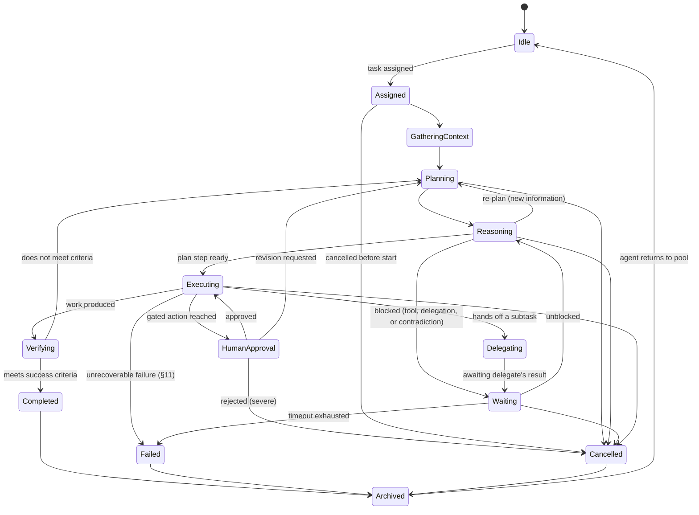
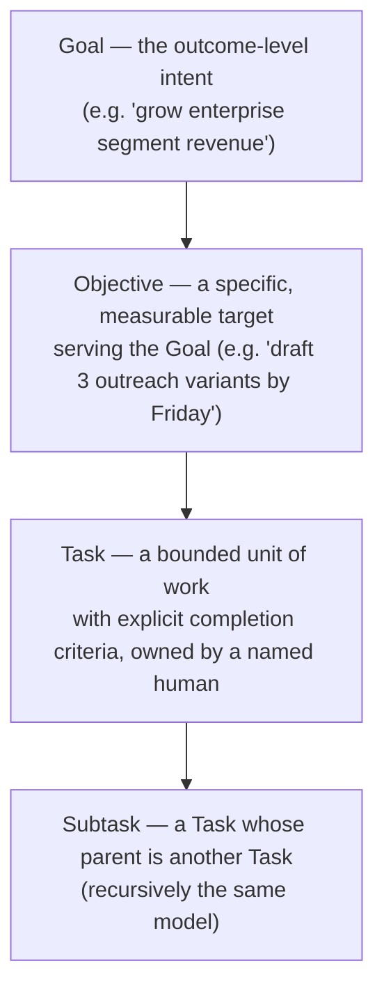
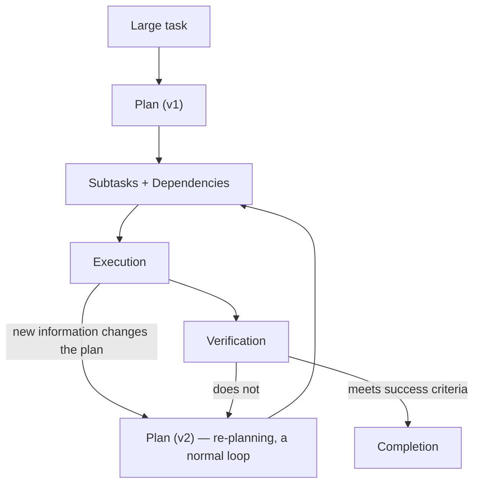
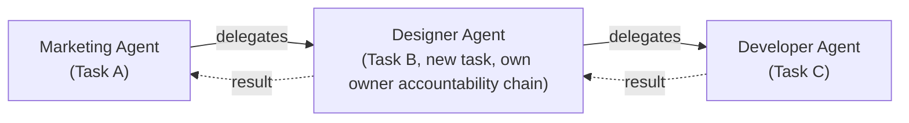
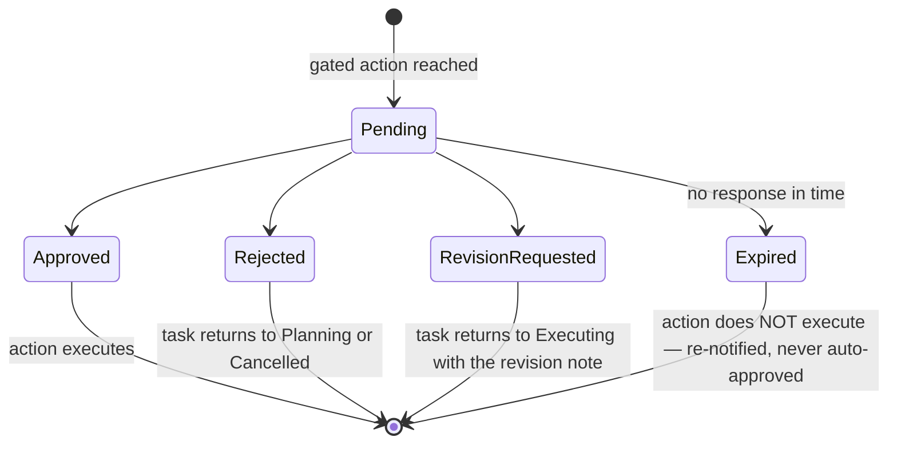
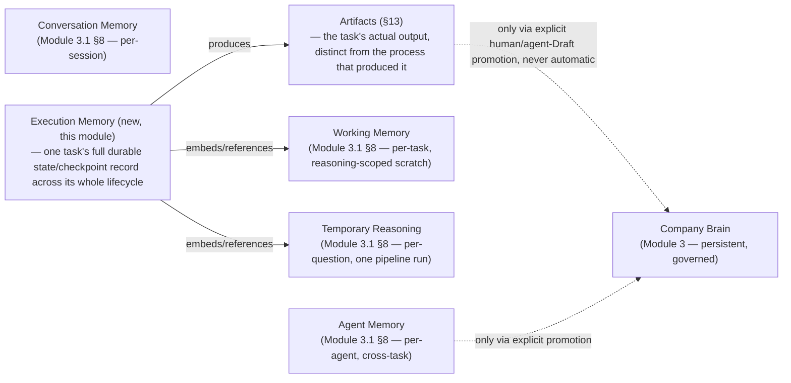
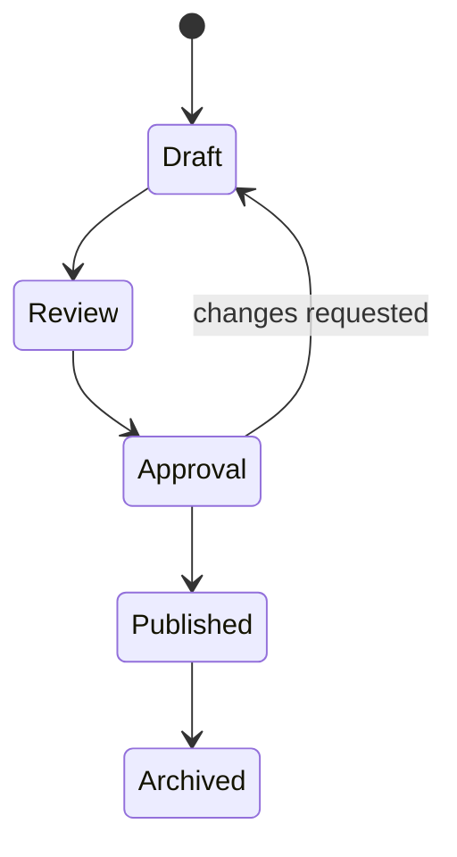
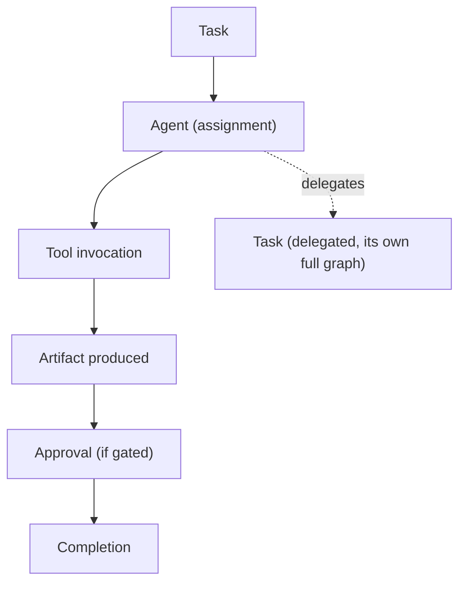

# Module 4 — Agent Runtime Architecture

**Status: the runtime FOUNDATION described here (§1's lifecycle, §2's Task model, §3's Execution Context, §4's Planning, §6's Delegation, §7's Human Approval, §8's Interruption recovery, §9's Execution Memory boundary, §10's Observability, §11's Failures, §12's Safety, §13's Artifacts, §14's Execution Graph) is now implemented — see `platform/docs/MODULE_7_AGENT_RUNTIME_CORE.md` for the full implementation report (schema, services, routes, tests). §5's Tool Model and §15's Future Workflows remain architecture-only, explicitly deferred per that implementation's own scope (no LLM provider, no external tools beyond internal platform actions, no workflow engine). One reconciliation worth recording here: §1's state diagram, taken literally, describes one already-Deployed agent's own runtime pointer (`Idle → Assigned → ...`), not a standalone Execution entity's lifecycle; the implementation renamed the diagram's states to snake_case for its `agent_executions.status` column and added exactly two states the diagram omits but this document's own prose requires (`queued`, before an agent is assigned; `paused`, called "an explicit, first-class control" in §8 but never drawn as a node) — see Module 7's own doc for the full reasoning. Module 2, Module 3, and Module 3.1 remain unmodified by this implementation, as originally designed.

**Clarification (Module 9):** §8's "now implemented" note above referred to the checkpoint/resume *mechanism* Module 7 shipped (checkpoints, `resolveResumeCheckpoint`, pause/resume). The actual *reconciliation pass* §8 describes — "finds every task last recorded as 'in progress' with no recent heartbeat, and resumes each from its last durable checkpoint" — was not implemented until Module 9 (`platform/docs/MODULE_9_RUNTIME_RECOVERY_AND_WORKERS.md`), which also adds the durable job queue and worker §8 assumes exists but never specified the mechanics of.

Module 3 designed what the Brain stores. Module 3.1 designed how knowledge becomes understanding. This document designs how an AI employee actually *works*: how it goes from being an idle, registered capability to a task in progress, how it plans, gathers context, calls tools, asks other agents for help, stops for a human's sign-off, survives being interrupted, and finishes — leaving behind a complete, honest record of everything it did and why. This is the operating-system scheduler for AI employees, not the employee's résumé (that is the Agent Registry, AGENT_FRAMEWORK §14 — out of scope here) and not its knowledge (that is the Brain).

**One disambiguation that matters before anything else**: AGENT_FRAMEWORK §2 already defines an agent's *existence* lifecycle — Idea → Specification → Development → Testing → Approval → Deployment → Monitoring → Improvement → Retirement. That lifecycle answers "does this agent exist and is it allowed to run at all." This document's Agent Lifecycle (§1) is a different, narrower thing: the *runtime* state of one already-Deployed agent while it is actively idle or working on a task. An agent can sit in AGENT_FRAMEWORK's "Monitoring" stage of existence for its entire operational life while cycling through this document's Idle → Assigned → ... → Archived states thousands of times. Neither lifecycle replaces the other; this document only ever operates *inside* AGENT_FRAMEWORK's Deployment/Monitoring stages.

---

## Goals

The runtime is designed to be, structurally, not by convention:

- **Explainable** — every decision a task's execution made is traceable to a reason, not just an outcome.
- **Auditable** — every state change, tool call, delegation, and approval is a permanent, append-only record.
- **Permission-aware** — every action re-validates real, current authorization, at the moment it happens, never once at task start and then trusted for the task's duration.
- **Interruptible** — nothing an agent does depends on an uninterrupted process staying alive; every meaningful step is a durable checkpoint.
- **Recoverable** — any interruption, from a closed browser tab to a full server restart, resumes cleanly from the last checkpoint, never from scratch and never by silently guessing what already happened.
- **Composable** — a single agent doing one simple task and fifty agents coordinating a company-wide workflow are the same architecture at different scale, never two different systems.
- **Observable** — the full state of any task, at any time, is answerable without asking the agent to explain itself after the fact.
- **Safe** — loops, cycles, permission escalation, and duplicate side effects are prevented structurally, not by hoping an agent behaves.
- **Scalable** — nothing in this design assumes a small number of agents; the safety and observability mechanisms are what make "hundreds of agents" (AGENT_FRAMEWORK §18) a scaling story instead of a risk story.

---

## 1. Agent Lifecycle (runtime execution states)

- **Idle** — the agent exists (per AGENT_FRAMEWORK's Registry), holds no active task, and is available for assignment. This is the resting state most of an agent's runtime life is spent in.
- **Assigned** — a Task (§2) has been handed to this specific agent, with an owner, and the agent has acknowledged it but not yet started work.
- **Gathering Context** — the Execution Context (§3) is assembled: tenant scope, permissions, Brain access, relevant memory, tool availability, prior history if this is a resume. Nothing downstream begins on a partial context.
- **Planning** — the agent produces or revises a Plan (§4): what subtasks exist, in what order, with what dependencies. Reachable more than once per task — re-planning is a normal, expected loop-back, not a failure.
- **Reasoning** — the agent invokes the Module 3.1 reasoning pipeline against the Brain to inform the current plan step: what does the company already know, how trustworthy is it, does anything contradict it. This state can loop back to Planning (new information changes the plan) or forward to Executing or Waiting.
- **Waiting** — the agent is blocked on something external to its own reasoning: a tool call in flight, a delegated subtask not yet returned, or a same-tier contradiction (Module 3.1 §6) escalated to a human. Distinct sub-reasons are always recorded (§10) even though "Waiting" is the single visible state — legibility matters more here than granularity.
- **Executing** — the agent performs a concrete action: a tool call, producing an artifact, or handing off work (branches to Delegating).
- **Delegating** — a specific mode of Executing where the current plan step is handed to another agent as its own new Task (§6), and this agent's own thread of work becomes Waiting on that delegate's result.
- **Human Approval** — the agent has reached a gated action (§7) that must not execute automatically; work pauses here until a named human responds.
- **Verifying** — after producing work, an explicit check against the task's own stated success/failure criteria (AGENT_FRAMEWORK §3) before declaring completion — this is what makes "Completed" mean something more than "the agent stopped."
- **Completed** — the task met its success criteria and produced whatever artifact or outcome it was assigned to produce.
- **Failed** — the task could not be completed after exhausting whatever recovery §11 allows for its specific failure class.
- **Cancelled** — the task was explicitly stopped before completion, by a human or by cascading cancellation from a parent task.
- **Archived** — the task's full record (every state it passed through, every event, every artifact) is preserved permanently, and the agent returns to Idle. Nothing about a task's history disappears at Archived — this is a status change for the *active work queue*, not a retention decision (matching the Brain's own "archived, never deleted" posture).

---

## 2. Task Model

A four-level hierarchy, kept distinct so "why does this exist" and "what specifically needs doing" are never collapsed into one thing:

- **Task** — reuses AGENT_FRAMEWORK §6's existing "Tasks" communication primitive ("a bounded unit of work handed off with explicit completion criteria, tracked until closed") directly, rather than redefining it — this document adds the runtime mechanics (lifecycle, retry, dependency, ownership) around that existing definition.
- **Goal** — the multi-task, often multi-department outcome a chain of Objectives/Tasks ultimately serves. Rarely completed by a single task; exists to give every task underneath it a real "why."
- **Objective** — a concrete, measurable target for one bounded piece of work — the level at which "done" actually means something specific, distinct from the Goal's more open-ended intent.
- **Subtask** — structurally identical to a Task, distinguished only by having a parent Task. Produced by Planning (§4), never created ad hoc mid-execution without being recorded in the current Plan version.
- **Dependency** — a directed edge between two tasks/subtasks where one cannot start (or cannot complete) until another finishes. Must support fan-in (one task waiting on several) and fan-out (several tasks waiting on one), and must be acyclic — enforced structurally (§12), not merely by convention.
- **Priority** — an explicit, assignable value, never implied by creation order; re-computable if a deadline changes or a dependency becomes blocking.
- **Deadline** — an optional target; missing one triggers notification/escalation, never a silent failure and never an automatic lower-quality shortcut to "make the deadline."
- **Retry** — a bounded, explicitly configured count, applied only to failures classified as transient (§11) — never applied to a human rejection or a permission denial, which retrying cannot fix.
- **Cancellation** — always possible, by the task's owner or by cascading from a cancelled parent; cascades to any active delegation (§6) and withdraws any pending Human Approval request (§7).
- **Ownership** — every task has exactly one accountable named human (never "the department," matching AGENT_FRAMEWORK §3's Anatomy field) — distinct from *which agent is currently executing it*. The agent does the work; the human owns the accountability for it having been done.
- **Escalation** — a task that cannot proceed escalates to its owner first, and to the domain-owning department (Module 3 §12) if the owner is unreachable — never left silently stalled in Waiting indefinitely.

**When should a task exist?** When work crosses a threshold worth tracking independently: it has its own completion criteria, could plausibly outlive a single request (needs to survive an interruption, §8), could be delegated, could fail and need retry, or could require approval. A single reasoning call inside Module 3.1's pipeline is not its own task — it's internal to the Reasoning state.

**When should a task disappear?** It never truly disappears — Archived tasks are retained permanently as part of the observability record (§10), the same "nothing important is lost" posture the Brain itself holds. "Disappearing" only ever means leaving the *active* work view, at the Archived transition.

---

## 3. Execution Context

Assembled once, as an explicit, immutable snapshot, at the Gathering Context state — never assembled piecemeal mid-task and never silently re-derived later in a way that could produce a different answer than what the agent actually started with.

**What it contains:**

- **Organization / Workspace** — the tenant scope (Module 2), inherited, never re-derived by the agent itself.
- **User** — the human who initiated or owns this task, if human-initiated.
- **Permissions** — the agent's own registered scope and Domain Grants (Module 3 §10), snapshotted for planning/reasoning purposes — **with one deliberate exception**: live, at-the-moment-of-action permission checks (§12) always re-validate against *current* grants, never solely against this snapshot, since a grant can be revoked mid-task and a snapshot must never be able to authorize an action after that revocation.
- **Brain access** — which domains and knowledge this agent may read, per its declared scope (AGENT_FRAMEWORK §4).
- **Conversation** — relevant Conversation Memory (Module 3.1 §8), if this task originated inside an ongoing conversation.
- **Previous work** — prior task/artifact history relevant to this one (e.g., revising an earlier draft, resuming after interruption).
- **Workflow** — if this task is one step of a larger multi-task orchestration (§15), a reference to that parent structure.
- **External tools** — which tools (§5) this agent may invoke for this task, and their current connection/auth state.
- **Execution history** — this task's own event log so far, essential when Gathering Context runs again after a resume (§8).
- **Temporary memory** — this task's own Working Memory scratch space (Module 3.1 §8), fresh for a new task, restored for a resumed one.

**How context is assembled**, as an ordered process: resolve identity and tenant scope → resolve the agent's own registered permissions/scope → resolve the task's position in any larger Goal/Objective/Workflow structure → resolve relevant Conversation Memory → resolve prior execution history if resuming → resolve tool availability and current authorization → assemble all of the above into one snapshot handed to the agent as it enters Planning. If anything material changes mid-task (a permission revoked, a workspace archived), that is treated as an interruption (§8) requiring the agent to stop and re-Gather-Context, never as a silent mutation of the context it's already reasoning against.

---

## 4. Planning

**Should plans be editable?** Yes — by the agent, freely, for low-stakes/fully-reversible tasks, mirroring AGENT_FRAMEWORK §7's "reversible and internal-only" band (any agent may act within its declared scope without waiting). For anything hard-to-reverse or external-facing, a plan revision that changes what will actually be *done* (not just internal sequencing) requires the same human-approval gate the underlying action itself would require (§7) — a plan is not a way to quietly pre-approve a gated action by approving an earlier, vaguer version of it.

**Should plans be versioned?** Yes — every material change to subtasks or dependencies produces a new Plan version, retaining the prior one, exactly mirroring the Brain's own versioning discipline (Module 3 §6) applied to a task-scoped, not company-knowledge-scoped, artifact.

**Should plans be audited?** Yes — every plan version carries a stated reason for existing (mirroring Module 3 §6's mandatory `changeReason`), and re-planning is itself a recorded event in the Execution Timeline (§10), never an invisible internal detail.

**Verification** is the explicit check, before Completion, of whether the produced work actually satisfies the task's own stated success/failure criteria (AGENT_FRAMEWORK §3) — restated here because it is the one step in this flow most tempting to skip under deadline pressure, and this design treats skipping it as an incomplete execution, not a shortcut.

---

## 5. Tool Model

Tools (email, CRM, calendar, database, Slack, WhatsApp, browser, GitHub, filesystem, internal APIs) are the runtime's interface to everything outside the Brain and outside pure reasoning.

- **Tool registration** — every tool an agent might use is registered with a minimal "anatomy" before any agent may be granted access to it: what it does, its side-effect class (read-only / internal-mutating / external-irreversible), and what kind of permission grant it requires. An unregistered tool is not callable by any agent, ever, mirroring AGENT_FRAMEWORK §14's stance that an unregistered *agent* is an incident, not an oversight — the same discipline applies to tools.
- **Tool permissions** — access to a *specific* tool is its own explicit grant, never inherited from an agent's domain scope or department (mirroring Module 3's Domain Grant "explicit, never inherited" philosophy). A grant to send email is further scoped to *which identity* the agent may send as — never a generic, unattributed "the company" sender — so that every external action traces to both the acting agent and its accountable human owner.
- **Tool execution** — every call is classified by reversibility and external impact *before* it executes, reusing Company OS §8 / AGENT_FRAMEWORK §7's existing decision matrix directly rather than inventing a parallel one: read-only calls execute within permission scope freely; anything hard-to-reverse or external-facing routes through Human Approval (§7) unless this exact agent+tool+action pattern has already earned standing Operator-tier autonomy (AGENT_FRAMEWORK §5, §8) through track record.
- **Tool failures** — classified under §11's taxonomy; generally transient (timeout, rate limit, temporary outage) and subject to bounded retry, with the specific exception of authorization failures, which should never be blindly retried (§11, §12).
- **Tool auditing** — every attempted and executed call is logged: which agent, under which task, with what parameters (redacted where sensitive), what result, under what Human Approval reference if applicable — feeding directly into Observability (§10) and reusing the append-only audit pattern Module 2 and Module 3 already established, rather than a new logging mechanism.

---

## 6. Delegation

- **Delegation creates a new, first-class Task** (§2), never a hidden sub-process — the delegate goes through its own full lifecycle (§1), its own Planning, its own Reasoning, with its own Execution Context (§3) resolved fresh for its own identity and permissions.
- **Ownership**: delegation passes *work*, never *permission*. A delegate must independently justify any gated action against its **own** grants — it may never simply trust that "my delegator already checked this." An agent cannot delegate its way into a capability it doesn't independently hold, and delegating to an agent that *does* hold it is not a loophole — the delegate is still fully, independently accountable for its own action, on its own authority, not borrowed authority.
- **Result passing**: the delegate's completed artifact/outcome returns via the Dependency edge (§2) that made the delegator Waiting; the delegator re-enters Reasoning to incorporate it.
- **Timeouts**: every delegation carries an explicit deadline (§2); an unresponsive delegate escalates to a human rather than blocking the delegator — and everything upstream of it — indefinitely.
- **Cycles**: structurally prevented. Every delegation carries the ordered ancestry of task IDs that led to it; a new delegation is rejected outright if its target agent already appears in that ancestry — never detected only after the fact.
- **Failure handling**: a delegate's failure or rejection is a real input to the delegator's own Reasoning state — retry with a different agent, escalate to a human, or fail the delegator's own task — never silently absorbed or ignored.

This formalizes AGENT_FRAMEWORK §6's existing "Tasks" communication primitive with the specific runtime mechanics (ownership boundary, timeout, cycle prevention) that primitive didn't yet need to specify on its own.

---

## 7. Human Approval

Some actions never execute automatically, regardless of the agent's permission level or track record: sending an email, deleting data, publishing a campaign, spending money, changing permissions — directly matching AGENT_FRAMEWORK §7's "hard-to-reverse or client-affecting" and "irreversible or company-wide" bands.

- **Approval request** — auto-generated the moment a plan step crosses into a gated band; contains exactly what will be done, why (citing the Reasoning trace and Plan version), and what evidence/confidence backs it (Module 3.1 §10, §11) — never a bare "may I proceed."
- **Approval states**: Pending, Approved, Rejected, Revision-Requested, Expired.
- **Rejection** — the task returns to Planning (a different approach may still satisfy the same objective) or is Cancelled, depending on the human's own instruction; the reason is permanently recorded, and — per AGENT_FRAMEWORK §8 — treated as *more* valuable signal for agent improvement than a routine approval.
- **Revision** — distinct from rejection: the underlying task is still wanted, but this specific proposed action needs a change (e.g., "send this email but change paragraph 2"). Routes back to Executing with the revision attached, not a full restart.
- **Expiration** — an unanswered request expires rather than sitting forever *or* silently proceeding. Expiration re-notifies/escalates; it never auto-approves and never auto-executes on timeout — a direct application of Company OS §26's "fail closed, not open."
- **Audit** — every request and its resolution is permanent Historical Memory: who approved, what exactly was approved, the agent's original unedited proposal (so drift between proposed and approved is measurable, feeding the "human edit rate" metric, AGENT_FRAMEWORK §12), and when.

---

## 8. Interruptions

**Core principle**: every meaningful step is a durable checkpoint, written *before* any side-effecting action proceeds, so a task's true progress is never held only in an ephemeral process's memory. This single principle is what makes every interruption type below reduce to the same recovery mechanism, rather than needing a bespoke handler per failure mode.

| Interruption | Recovery |
|---|---|
| **Browser closes** | Irrelevant to execution — the runtime is server-side and durable; a browser tab is only ever an *observer* of a task, never what keeps it alive. Closing it does nothing to the task. |
| **Server restart / runtime deployment** | On restart, a reconciliation pass finds every task last recorded as "in progress" with no recent heartbeat, and resumes each from its last durable checkpoint — never from scratch, never by guessing what already happened. |
| **LLM timeout** | Transient (§11) — bounded retry, then escalate if exhausted. |
| **API / tool failure** | Transient (§11) — same as above; every retryable, side-effecting call carries an idempotency key so a retry can never re-execute an already-succeeded side effect (a sent email is never sent twice because a retry fired after the send actually succeeded but before the success was recorded). |
| **Human pauses** | An explicit, first-class control distinct from passive disconnection — pauses at the *next safe checkpoint* (never mid-side-effect), and resuming requires an explicit human/owner action, never automatic timeout-based resumption. |
| **Task cancelled** | Cascades cleanly: active delegations are signaled to cancel (best-effort — a delegate whose own side effect already completed cannot be un-executed, only marked accordingly), any pending Human Approval request is withdrawn. |
| **Power failure** | Identical to server restart from the runtime's perspective — the durable-checkpoint design means there is no special case here at all. |

---

## 9. Memory During Execution

Extends, and does not modify, Module 3.1 §8's memory layering — this document adds exactly one new, execution-specific layer and clarifies how it relates to what Module 3.1 already defined.

- **Execution Memory** is this task's own durable record: which subtasks are done, what tool calls were made and their results, which Plan version is current, what checkpoints exist for recovery (§8). It is broader and longer-lived than Module 3.1's Working Memory (which is specifically the reasoning engine's scratch space) — Execution Memory *contains* a task's Working Memory and Temporary Reasoning history as part of its full record, rather than being the same thing.
- **Artifacts** (§13) are the task's actual output — distinct from the process-memory that produced it. Once a task completes, its Execution Memory is retained for audit (§10), but the Artifact is what actually carries forward into further work or potential Brain promotion.

**Nothing temporary automatically becomes Brain knowledge — restated at the runtime level, because this is where the temptation is strongest.** A task's Execution Memory might contain a genuinely useful pattern the agent stumbled onto; promoting it into the Brain always means authoring a fresh Draft-tier Knowledge Item citing the task/artifact as Source (Module 3.1 §8's exact rule), never an automatic sync, batch import, or "graduation" of the execution record itself.

---

## 10. Observability

Every view below is a **projection over one underlying append-only Events stream**, never a separately-maintained parallel record that could drift out of sync with it — the same "one log, many views" discipline Module 2's `audit_logs` and Module 3's Lifecycle-Event/Access-Log split already established.

- **Events** — the raw stream: every state transition, tool call, delegation, approval request/response, and failure. This directly satisfies AGENT_FRAMEWORK §11's logging requirement (what was done, which agent, at what permission level, based on what Brain entries, what the output was, whether/how a human reviewed it, when).
- **Logs** — lower-level, higher-volume diagnostic detail (comparable to Module 3.1's Temporary Reasoning trace, generalized to tool-call-level detail) — kept separate from the structured Events stream for the same volume/retention reasons Module 3 §11 already separated its Access Log from its Lifecycle Events.
- **Metrics** — aggregated from Events, directly reusing AGENT_FRAMEWORK §12's existing metric list (Accuracy, Latency, Usefulness, Trust, Quality, Human edits, Approval rate, Failures, Escalations) rather than inventing a parallel taxonomy.
- **Status** — a task or agent's current lifecycle state (§1), always a read of the latest relevant Event, never separately tracked truth that could disagree with the event log.
- **Progress** — for a multi-subtask Plan, a computed fraction/summary derived from subtask completion status — a projection, not independently maintained state.
- **Execution Timeline** — one task's ordered sequence of everything above, from Assigned to Archived — the task-centric view.
- **Agent Timeline** — one agent's ordered activity across many tasks over time — the agent-centric complement, feeding Agent Health (AGENT_FRAMEWORK §13).
- **Reasoning trace** — Module 3.1's per-question Temporary Reasoning output, linked into the Execution Timeline at the exact point each Reasoning-state invocation occurred.
- **Approvals** — the full request/response record (§7), linked into the timeline at the point requested and resolved.
- **Delegation graph** — the DAG of which task delegated to which other task/agent (§6) — a graph view restricted specifically to delegation-type Dependency edges (§2).

---

## 11. Failures

| Failure | Typically | Default behavior |
|---|---|---|
| **Tool failure** (API error, rate limit) | Transient | Bounded retry (§8's idempotency-safe retry), then escalate if exhausted |
| **Permission failure — expected** (task legitimately needs a grant this agent lacks) | Not retryable | Escalate to the task's human owner: grant it, or reassign/delegate to an agent that already holds it |
| **Permission failure — unexpected** (agent attempted something outside its *own declared scope*) | Not retryable | Treated as a safety incident (AGENT_FRAMEWORK §9 rule 7) — escalated with Security & Trust visibility, not just the task's normal owner |
| **Knowledge missing** (Module 3.1 returns "Unknown") | Not a crash — a valid, expected outcome | Surfaced honestly in the eventual output, or escalated if the missing knowledge is essential to proceeding — never silently guessed around |
| **Contradiction** (Module 3.1 §6 same-tier conflict) | Not a crash | Task pauses in Waiting, escalates to the relevant domain owner(s) per Module 3.1's own rule; resumes once a human resolves it |
| **Timeout** (a step, tool call, or delegation exceeds its allotted time) | Transient | Bounded retry, then escalate |
| **Human rejection** (§7) | Never retried | Returns to Planning for revision, or Cancelled, per the human's own instruction |
| **Provider outage** (the underlying LLM/tool provider is down broadly, not one call) | Transient but potentially long | Back off more aggressively than a normal retry; may pause the whole task rather than burn its bounded retry budget uselessly |
| **Unexpected runtime error** (a genuine bug, not a domain-classified failure) | Terminal for this attempt | Fail closed: halt at the last durable checkpoint, log full diagnostic detail, escalate to Engineering/AI Systems — never attempt silent self-repair |

**The overarching rule, restated from AGENT_FRAMEWORK §10 and applied here structurally**: fail closed, never self-repair by guessing, always halt at the last verified checkpoint and hand off to a human when genuinely in doubt, and treat "the Brain/tool has no answer" as valuable information about a real gap, not an edge case to quietly route around.

---

## 12. Safety

| Threat | Structural safeguard |
|---|---|
| **Infinite loops** | Every Planning/Reasoning re-plan loop (§4) has a hard maximum-iteration ceiling; exceeding it is itself a failure that escalates, never an unbounded background process |
| **Agent wars** (two agents repeatedly reacting to each other) | Agents never negotiate authority peer-to-peer (AGENT_FRAMEWORK §6) — any detected reactive loop pauses **both** agents and escalates to their shared human domain owner, using the same ancestry-tracking mechanism as delegation cycles |
| **Repeated delegation** | The delegation-ancestry cycle check (§6) plus a hard maximum delegation *depth* (not just cycle detection) — exceeding it forces escalation regardless of whether a true cycle was ever detected |
| **Permission escalation** | Delegation passes work, never permission (§6) — a delegate must independently justify its own action against its own grants; no chain of delegations can ever produce more *effective* authority than the single most restrictive link in it |
| **Cross-tenant access** | Inherited absolutely from Module 2/3/3.1 — no Execution Context (§3), tool call, or delegation is ever allowed to cross an organization boundary; this runtime adds no new cross-tenant capability anywhere |
| **Unauthorized tool use** | Every gated tool call re-validates *current*, live permission grants at the moment of the call — never solely the Execution Context snapshot taken at task start (§3's stated exception) |
| **Hallucinated execution** (an agent claiming it did something it didn't) | The Completed transition (§1) is gated on real, logged tool-call/artifact evidence existing in the Events stream — never on the agent's own narrative alone. This is the runtime analog of Module 3.1's "citations must be mechanically derived from the real trace, never generated" rule |
| **Unsafe retries** | Every retryable, side-effecting tool call carries an idempotency key from its first attempt, checked before any re-execution — a retry can detect "this already succeeded" and skip re-executing the side effect |
| **Duplicate execution** (e.g., two scheduler instances picking up the same task after a restart) | A task can only be actively claimed by one execution process at a time — a single-owner lock at the scheduler level, named here as a hard requirement though the specific locking mechanism is an implementation detail out of this document's scope |

---

## 13. Artifacts

Emails, reports, presentations, marketing copy, code, summaries — everything an agent's execution actually produces.

This deliberately mirrors Module 3's own Knowledge lifecycle shape, because it is functionally the same kind of progression (unreviewed → reviewed → authorized → visible → retained) applied to a task's output rather than to company knowledge.

**Relationship to the Brain**: an Artifact is a *task-execution-scoped* concept, owned by its Task and versioned within that task's own Execution Memory — it does **not** automatically live in the Brain as a Knowledge Item. Publishing an artifact (sending the email, shipping the code, presenting the deck) and *promoting* it into company knowledge are two separate decisions. Only when a human (or an agent proposing a Draft, per the standard rule) explicitly decides "this is worth the company remembering" does a new Knowledge Item get authored, citing the Artifact as its Source — a sent email does not become a Knowledge Item just because it was sent; someone has to decide its approach is worth recording as a reusable pattern.

---

## 14. Execution Graph

**Graph philosophy**: the execution graph is a directed, acyclic structure (acyclicity enforced per §12) whose node types are Task, Agent (assignment edges), Tool (invocation edges), Artifact (production edges), Approval (gating edges), and Delegation (subtask edges to an entirely separate task graph). A single agent doing one simple, tool-free, approval-free task is not a structurally different thing from fifty agents coordinating a company-wide initiative — it is the same graph shape at its smallest possible size. This is the direct expression of the Composable goal: nothing about scaling up requires a different architecture, only more nodes and edges of the same kinds.

**This is a distinct graph from Module 3.1's Brain Graph, not the same structure wearing two names.** The Execution Graph and the Brain Graph reference each other at specific, well-defined points — a task's Reasoning state queries the Brain Graph; a task's Completed Artifact may become a Brain Graph node via explicit promotion (§13) — but they are not merged, and a query across one is never assumed to silently traverse into the other.

---

## 15. Future Workflows

Marketing, Sales, Support, Finance, Development, HR, Operations, and a CEO-level agent all run on **exactly this architecture, unchanged**. What differs per department is never the runtime — it is only:

- Which specific agents are assigned to which tasks.
- Which Brain domains and which tools those agents are scoped and granted to (Module 3.1 §14's own table applies here unchanged).
- What a typical Goal/Objective/Task looks like for that department, and what its typical reversibility/impact band is (a Finance task involving money is disproportionately more likely to route through Human Approval than a Support triage task).

**"Workflow Engine" is not a separate system this runtime needs to grow into later — it is what this runtime is already called when it is coordinating a larger graph of tasks and agents toward one Goal**, rather than a single agent working a single task. Nothing about §14's Execution Graph changes shape to support "a workflow" versus "a task" — a workflow is simply a larger instance of the identical graph. This is a deliberate design economy: this document does not need, and does not propose, a second architecture for orchestration once individual-agent execution already composes.

---

## 16. Open Questions

Genuinely unresolved runtime-specific forks — none decided silently:

1. **Exact bounded-retry limits and backoff strategy** (§8, §11) — that bounds and backoff must exist is decided; the specific numbers are not.
2. **Exact maximum delegation depth and maximum re-planning iteration count** (§4, §12) — that hard ceilings must exist is decided; where those ceilings sit is not.
3. **How live, at-call-time permission re-validation (§12) is performed without material latency cost per tool call** — a real engineering tradeoff, not resolved here.
4. **Whether a Plan is its own first-class versioned entity, or a simpler structure folded into Execution Memory** (§4, §9) — this document leans toward "own entity" for auditability but does not close the question.
5. **Whether Agent Wars detection (§12) needs a dedicated monitoring subsystem**, or is fully covered by the ancestry-tracking and rate-limit mechanisms already described — flagged as possibly needing more than what's designed here, not confirmed either way.
6. **Retention policy for Execution Memory and Logs at the storage level** (§9, §10) — likely far higher volume than Brain content; this document states the need without proposing numbers or a pruning strategy.
7. **How standing (Operator-tier) approval bypass is granted, reviewed, and revoked for a specific agent+tool+action pattern** (§5, §7) — this document assumes it exists in principle (matching AGENT_FRAMEWORK's trust ladder) but does not design the granting mechanism itself.
8. **Whether Artifacts are versioned using the same mechanism as Module 3's Knowledge Version, or their own simpler runtime-scoped version concept** (§13) — leaning toward the simpler, separate mechanism (since most artifacts are never promoted) but not firmly closed.
9. **Whether a paused task is guaranteed indefinitely resumable, or itself subject to an expiry** (§8) — not decided; affects how "pause" differs from "cancel" in practice.
10. **The specific mechanism for detecting *reactive* (non-explicit-delegation) agent-to-agent triggering** for the Agent Wars safeguard (§12) — this document names the requirement without specifying how such implicit triggering would even be structurally detected.
11. **Whether the Execution Graph and the Brain Graph should share common traversal/observability tooling**, or remain fully independent implementations that merely reference each other (§14) — an open integration question.
12. **Governance for who may grant standing tool/approval authority to an agent** — likely the same Human Approval Model as AGENT_FRAMEWORK §8, but not explicitly re-confirmed here for this runtime specifically.

---

## Tradeoffs

- **Durability vs. overhead**: checkpointing at every meaningful transition (§8) is what makes interruption recovery uniform and simple, at the real cost of a write on every state change — accepted deliberately, since the alternative (in-memory-only state) makes "server restart" and "power failure" catastrophic instead of routine.
- **Legibility vs. granularity in lifecycle states** (§1): naming "Waiting" as one visible state with recorded sub-reasons, rather than several distinct blocked-states, is easier for a human to scan but loses some at-a-glance detail — accepted because Observability (§10) recovers the detail on demand, and the Explainable goal favors a simple top-level story over a maximally granular one.
- **Strictness vs. friction in permission re-validation** (§3, §12): re-checking live permissions on every gated call, rather than trusting the task-start snapshot, is safer but adds real per-call cost — accepted because the alternative (a stale snapshot authorizing a since-revoked action) is a genuine, serious security gap, not a theoretical one.
- **Simplicity vs. completeness in the Artifact/Brain boundary** (§13): keeping Artifacts fully separate from Knowledge Items (requiring an explicit promotion decision every time) means genuinely useful task output can go unrecorded if nobody bothers to promote it — accepted because the alternative (automatic promotion) is exactly the "temporary becomes knowledge silently" failure mode both this document and Module 3.1 explicitly reject.

## Rejected alternatives

- **A single "blocked" state with a reason code, instead of distinct Waiting/Human Approval states** (§1). Rejected — named states are more legible to a human scanning system state, matching the Explainable goal more directly than a generic state plus metadata would.
- **Trusting the Execution Context's permission snapshot for the whole task duration** (§3, §12). Seriously considered for the performance benefit, then rejected — a revoked grant must stop an in-flight action, not merely future tasks, and this is treated as non-negotiable rather than a tunable tradeoff.
- **Letting a delegate trust that its delegator already checked authorization** (§6, §12). Rejected — this is exactly how permission-laundering through delegation chains would happen; every delegate independently re-justifies its own action, with no exception for "my delegator is more senior."
- **Auto-approving a Human Approval request on expiration, to avoid stalling work** (§7). Rejected outright — fail-closed (Company OS §26) means a missing approval must mean "don't proceed," never "proceed anyway because nobody objected in time."
- **A separate orchestration architecture for multi-agent "workflows," distinct from single-task execution** (§14, §15). Rejected — the Execution Graph already composes to arbitrary scale; inventing a second system for the "workflow" case would duplicate the lifecycle, permission, delegation, and observability mechanics this document already built once.
- **Modeling Artifacts as Knowledge Items directly, always** (§13). Rejected — this would mean every sent email or draft immediately becomes company knowledge, contradicting the explicit "nothing temporary automatically becomes Brain knowledge" rule this document and Module 3.1 both hold as non-negotiable.

## Recommended implementation order

Strictly sequenced after Module 3's storage layer and Module 3.1's reasoning pipeline are both implemented and verified — this runtime has nothing to reason with or check permissions against otherwise. **None of this is authorized to begin until this document is approved.**

1. **Task model and lifecycle state machine only, no agents yet** — prove Goal/Objective/Task/Subtask, Dependency, Ownership, and the full state diagram (§1) against manually-driven (human-only, no AI) test tasks, to validate the durability/checkpoint mechanics (§8) before any agent touches it.
2. **Execution Context assembly** (§3) — wired to real Module 2 tenant data and real Module 3/3.1 permission grants, proving the snapshot-plus-live-recheck split (§3, §12) end-to-end.
3. **Interruption recovery** (§8) — deliberately proven *before* real agent reasoning is wired in, so restart/resume correctness is validated against simple, deterministic tasks rather than debugged for the first time against unpredictable agent behavior.
4. **Human Approval** (§7) — the full request/response/expiration state machine, proven against manually-triggered gated actions before any agent can reach one autonomously.
5. **Tool Model** (§5) — registration, permission grants, execution classification, and idempotent retry — starting with one low-stakes, read-only tool before any external-facing or irreversible one is registered at all.
6. **First real agent, single-task, no delegation, no tools beyond read-only** — the narrowest possible real end-to-end run: Idle → Assigned → Gathering Context → Planning → Reasoning → Executing → Verifying → Completed → Archived, fully observed (§10).
7. **Failure classification and safety guards** (§11, §12) — retry bounds, cycle/depth limits, and the hallucinated-execution gate, proven with deliberately-induced failures before broader rollout.
8. **Delegation** (§6) — introduced only after single-agent execution is solid, starting with two agents and a shallow depth limit, before any deeper chain is allowed.
9. **Artifacts and the Brain-promotion boundary** (§13) — the Draft→Review→Approval→Published→Archived artifact lifecycle and the explicit, human-gated promotion path into Module 3's Knowledge Items.
10. **Broader tool registration** (external-facing: email, CRM, Slack, etc.) — added one at a time, each proven at Human-Approval-gated autonomy before any is considered for standing Operator-tier bypass (§15.7).
11. **Multi-agent, multi-task orchestration ("workflows")** (§15) — introduced last, explicitly as a scale-up of the same Execution Graph rather than new architecture, once single-agent and simple-delegation cases are both proven solid.
12. **Department-specific agent onboarding** (§15's list) — sequenced by real business need, a product decision this document takes no position on, exactly as Module 3.1 §15 already deferred the equivalent question for reasoning-layer agent onboarding.

---

*This document is an architecture review. No runtime implementation code, schema, migration, API, or UI has been created as a result of it, and Modules 2, 3, and 3.1 have not been modified. Implementation begins only after explicit approval, and only after the storage and reasoning layers it depends on are already built and verified.*
