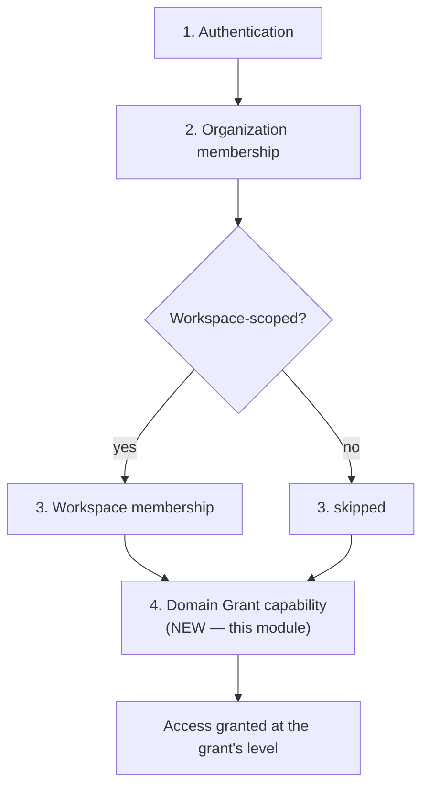

# Brain Module 7 — Brain Permissions

Implements Module 7 of `platform/docs/MODULE_5_BRAIN_IMPLEMENTATION_PLAN.md`, on top of the approved Brain Modules 1–6. Replaces every temporary organization/workspace-*role*-based authorization stand-in that has lived in `src/lib/brain/authz.ts` since Module 1 with the real, explicit, domain-aware Domain Grant `MODULE_3_BRAIN_ARCHITECTURE.md` §10 always promised: a fourth, independent gate, layered on top of — never replacing — authentication, organization membership, and workspace membership.

---

## Contradictions and open questions reviewed before implementation

Per this task's own instruction to stop and report rather than silently resolve, the architecture (`MODULE_3_BRAIN_ARCHITECTURE.md`), the graph/reasoning design (`MODULE_3_BRAIN_GRAPH_AND_REASONING.md`), the implementation plan, and Modules 1–6 were reviewed together before writing any code. Two real tensions surfaced:

1. **§15 Open Question #12 — does a workspace-scoped item need *both* Workspace membership *and* a Domain Grant, or can a sufficiently-privileged Domain Grant bypass the workspace check?** The architecture's own §10 gate-chain diagram assumes both are always required when both apply, but §15 explicitly flags this as an unconfirmed assumption, not a settled rule, and invites explicit resolution during implementation. **Resolved as exact-scope-match, no crossing**: an organization-scoped grant (`workspace_id IS NULL`) governs only organization-scoped content; a workspace-scoped grant governs only that exact workspace's content; neither extends into the other's territory automatically. This is the stricter of the two readings the open question left available — chosen because the architecture doesn't specify the looser (crossing) behavior, it only leaves the question open, and because every prior Brain module's own precedent (Module 1's hardening pass, above all) consistently resolved similar ambiguities toward stricter tenant isolation, never looser.
2. **Entity 12's "Ownership: department lead for that domain (day-to-day grants); Founder's Office for Identity-domain grants specifically."** This conflicts with the task's own candidate management-authority policy (organization owner/admin), and is not implementable as literally written: §15 Open Question #2 already flags the domain-to-department mapping itself as unconfirmed, pending an explicit Founder's Office decision, and Module 6 deliberately left `ownerDepartment` unresolved with no department table to query at all. Department-lead authority is therefore not a settled rule this module is silently overriding — it is itself already unresolved in the architecture. **Resolved by adopting the task's own documented fallback**: organization owner manages organization-scoped grants; organization owner or admin manages workspace-scoped grants (see "Permission-management authority" below). This is an explicit, temporary substitute for a not-yet-buildable rule, not a silent deviation from a settled one — revisit once Module 6's department model exists.

No other conflict was found between the four grounding documents and this implementation.

---

## The fourth gate

Every Brain operation now evaluates, in order, exactly as `MODULE_3_BRAIN_ARCHITECTURE.md` §10 describes:

No organization or workspace role is ever consulted for a content decision anywhere in `src/lib/brain/*.ts` — that was always the point of calling the old rules "temporary." An organization owner reading, writing, or archiving a workspace-scoped item they have no explicit workspace membership in is still rejected at gate 3, exactly as before; an organization owner or admin with workspace membership but no Brain-domain grant is now *also* rejected, at gate 4 — a real gap Module 1–6 never closed.

---

## Capability model

`brain_capability` (Postgres enum, one value per grant row — never a bundled role or capability array, matching this schema's own `relationship_type`/`trust_tier` convention):

| Capability | Source | Used by |
|---|---|---|
| `read` | Architecture's exact `accessLevel` | Every read path |
| `draft_write` | Architecture's exact `accessLevel` | `createKnowledgeItem`, `createRelationship` (via read on both endpoints) |
| `edit_own_draft` | Task refinement | `updateKnowledgeItem`/`restoreKnowledgeItemVersion`/relationship archive, only when the actor is the item's own author |
| `edit_any_draft` | Task refinement | Same operations, regardless of authorship — a strict superset of `edit_own_draft` in effect |
| `approve` | Architecture's exact `accessLevel` | `attachTrustMetadata` — never substitutable by authorship |
| `archive` | Architecture's exact `accessLevel` | `archiveKnowledgeItem` — never substitutable by authorship, unlike update |
| `purge` | Architecture's exact `accessLevel` | Storage-ready, no operation yet (Module 3's narrow, jointly-authorized purge path is unbuilt) |
| `manage_permissions` | Task refinement | Storage-ready; role-based management authority is used for now (see below) — reserved as the future durable delegated-authority mechanism |

The architecture's exact five (`read`, `draft-write`, `approve`, `archive`, `purge`) plus three non-contradictory refinements the task requested (`edit_own_draft`/`edit_any_draft` splitting "edit," `manage_permissions` for future delegation) — a superset, not a departure.

---

## Scope model

A grant is `(organizationId, domain, workspaceId | null, granteeUserId, capability)`. `workspaceId IS NULL` means organization-scoped; a specific workspace ID means scoped to exactly that workspace. See "The fourth gate" above for the exact-scope-match resolution. Multiple active grants at the identical scope combine by union (holding both `read` and `draft_write` rows means both apply).

Human users only. Non-human/agent grantees are explicitly deferred (see "Deferred" below) — the schema's grantee FK chain is additive-ready for a future agent-identity path but nothing here builds it.

---

## Schema

`drizzle/0011_warm_shooting_star.sql` — purely additive: one new enum, one new table, three composite FKs, two partial unique indexes, three regular indexes. No existing table, column, or row is altered.

### `brain_permission_grants`
`id`, `organization_id`, `domain` (reuses `knowledge_domain`), `workspace_id` (nullable), `grantee_user_id`, `capability` (`brain_capability`), `revision` (optimistic-concurrency counter, default 1), `granted_by_user_id` (nullable, `ON DELETE SET NULL`), `reason` (nullable, bounded text), `revoked_at` (nullable — `NULL` = active), `revoked_by_user_id` (nullable, `ON DELETE SET NULL`), `created_at`, `updated_at`.

### Tenant-safety: three composite FKs, all exploiting Postgres `MATCH SIMPLE`

1. `(workspace_id, organization_id) → workspaces(id, organization_id)` — a workspace-scoped grant's workspace must belong to the grant's own organization. Automatically skipped when `workspace_id IS NULL` (an organization-scoped grant).
2. `(grantee_user_id, organization_id) → organization_memberships(user_id, organization_id)` — the grantee must be a real organization member; losing that membership cascades away any grant it once justified.
3. `(grantee_user_id, workspace_id) → workspace_memberships(user_id, workspace_id)` — a workspace-scoped grant's grantee must be a real member of that exact workspace; automatically skipped when `workspace_id IS NULL`.

Postgres's default `MATCH SIMPLE` semantics mean a composite FK with any `NULL` column is skipped entirely — exactly what lets FKs 1 and 3 apply only to workspace-scoped rows without a magic sentinel UUID.

### Duplicate-active-grant prevention: two partial unique indexes, not one

A single unique index across a nullable `workspace_id` would never catch two organization-scoped (`workspace_id IS NULL`) duplicates — Postgres treats every `NULL` as distinct from every other `NULL` in a unique index. `brain_permission_grants_org_scoped_active_unique` (`organization_id, domain, grantee_user_id, capability` WHERE `workspace_id IS NULL AND revoked_at IS NULL`) and `brain_permission_grants_workspace_scoped_active_unique` (adds `workspace_id` to the key, WHERE `workspace_id IS NOT NULL AND revoked_at IS NULL`) together close that gap for both scope shapes.

### Revocation is one-way

Identical to the "archive, never un-archive" philosophy already established for knowledge items and relationships — `revoked_at` only ever transitions `NULL → timestamp`; re-granting is always a brand-new row, never a flag flip.

### Query patterns the indexes serve
"Every active grant for this user" (effective-permission resolution, on every Brain operation) — `brain_permission_grants_org_grantee_active_idx (organization_id, grantee_user_id, revoked_at)`. "Every grant for this domain" / "every grant for this workspace" (admin listing) — `brain_permission_grants_org_domain_idx`, `brain_permission_grants_workspace_idx`.

**Applied and verified directly against the live database** (the established statement-by-statement workaround for `drizzle-kit migrate`'s unreliability in this sandboxed environment, used again here) — all 14 statements confirmed applied via a live query before the scratch verification file was deleted. `db:check` confirmed clean afterward.

---

## Domain ownership (Module 6) stays unresolved — by design

`knowledgeDomainMetadata.ownerDepartment` remains nullable, exactly as Module 6 left it. This module does **not** invent a department table to populate it. Brain-domain permission grants work today with zero dependency on named department ownership — a grant is `(organization, domain, workspace, grantee, capability)`, never `(department, ...)`. Named department ownership, when the Founder's Office resolves §15 Open Question #2, can be layered on additively later: a `departments` table plus a `department_id` FK on domain metadata (populating `ownerDepartment`) and, separately, a policy that lets a department lead manage grants for their domain without needing the org owner/admin fallback — neither requires touching `brain_permission_grants`' own shape.

---

## Permission-management authority

Reviewed against the architecture (see "Contradictions" above) before adopting the task's candidate policy:

- **Organization-scoped grant** (`workspaceId: null`) — organization **owner** only.
- **Workspace-scoped grant** — organization **owner or admin** (there is no narrower "administratively manageable workspace subset" anywhere else in this codebase to borrow; `requireOrganizationAdminOverride`'s own existing precedent is already org-wide, not per-workspace).
- **Deliberately NOT extended to workspace *manager* role** — Brain capability grants are a more sensitive authority than ordinary workspace membership administration, and the task's own candidate policy names only owner/admin.
- **Bootstrap** — organization owner only (see below).
- **Grant managers never automatically receive content access.** An admin who may create/list/revoke grants for a workspace holds zero Brain capabilities themselves unless a real grant row says so — proven directly by a test (`listBrainPermissionGrants` succeeds for an admin with grant-management authority; a subsequent `requireBrainReadAccess` for the same admin, same scope, still fails).
- **"A person cannot grant a capability they aren't authorized to assign."** Checked via the actor's own *organization-scoped* capability for the grant's domain — regardless of whether the grant being created is itself workspace-scoped. This is a deliberate, narrow exception to the exact-scope-match rule governing ordinary content access: requiring an admin to already hold a workspace-scoped grant for that *exact* workspace before they could ever hand one out would make the first-ever workspace-scoped grant for any workspace impossible to create (bootstrap only seeds organization-scoped rows). Checking org-scoped holding keeps the rule meaningful — "you must yourself be trusted with this capability for this domain, at least at the organization level, before you may hand it to anyone" — while staying bootstrap-compatible.

`manage_permissions` is reserved, not yet wired to anything — role-based authority is the real mechanism for this module; `manage_permissions` becomes the durable delegated-authority mechanism only in a later, explicitly-scoped revision (avoiding a second, competing authority path from day one, per this module's own "no complex deny rules unless required" instruction).

No global administrator was introduced anywhere in this design.

---

## Effective-permission resolution

`resolveEffectiveBrainCapabilities(db, {organizationId, domain, workspaceId}, actorUserId)` is the single primitive every `requireBrain*Access` function and `getEffectiveBrainPermissions` builds on: one query, exact-scope match, returns the union `Set` of active capabilities. Default deny — an actor with zero rows at a scope has zero capabilities there, full stop; no capability is ever assumed from role, membership, or authorship.

Precedence, all deliberately simple per "no complex deny rules unless the architecture requires them":

1. Grants combine by **union** within one exact scope.
2. Organization-scoped and workspace-scoped grants **never cross** (see "The fourth gate").
3. Revocation applies **immediately** — the very next query re-resolves the actor's capability set from scratch; there is no cache, session-embedded permission snapshot, or delay of any kind. Proven directly by a test: revoke, then immediately attempt the same operation, observe rejection.

---

## Migration from temporary authorization (CRITICAL)

Every prior Brain module's role-based stand-in was replaced, not left running alongside the new system:

| Module | Operation | Old (temporary) rule | New rule |
|---|---|---|---|
| 1 | `createKnowledgeItem` | org role member+ (workspace role member+ if scoped) | `draft_write` at exact scope |
| 1 | `getKnowledgeItemForUser` | org membership (+ workspace membership if scoped) — **never actually checked a capability at all** | org/workspace membership **+ `read`** at exact scope (a real gap, now closed) |
| 1 | `listKnowledgeItemsForUser` | membership-filtered only, no capability check | membership-filtered **+ batched `read`-capability filter** (avoids N+1 via one grants query per list call) |
| 1 | `updateKnowledgeItem` | author, or org owner/admin | `edit_any_draft`, or `edit_own_draft` while the author |
| 1 | `archiveKnowledgeItem` | org owner/admin (workspace **manager** for workspace-scoped, per the Module 1 hardening pass) | `archive` capability, never substitutable by authorship or any role |
| 3 | `createRelationship` | read access on both endpoints (already capability-gated via `getKnowledgeItemForUser`) | unchanged shape, now genuinely capability-gated on both endpoints |
| 3 | `archiveRelationship` | update authority on both endpoints (author, or org owner/admin, or workspace manager) | `edit_any_draft`/`edit_own_draft` on **both** endpoints independently — never the relationship's own `creatorUserId` |
| 4 | `attachTrustMetadata` | org owner/admin | `approve` capability, never substitutable by authorship or role |
| 4 | `createEvidence` | ordinary update authority (author, or org owner/admin) | `edit_any_draft`/`edit_own_draft` — a deliberately lower bar than `approve`, matching entity 7's broader "whoever performed the verification" |

No two competing authorization systems were ever active — `authz.ts` was rewritten in place; every call site was migrated in the same pass; the old role-based branches were deleted, not deprecated-in-place.

### Bootstrap strategy (avoiding an accidental lockout)

The very first grant an organization ever needs cannot itself be created through the normal flow — creating any grant requires the actor to already hold grant-management authority *and* already hold the capability being assigned, and a brand-new organization has zero grants for anyone. `bootstrapBrainPermissions` is the explicit, one-time answer:

- **Owner-triggered only** (never automatic, never on organization creation).
- **Idempotent by refusal**: the moment *any* grant already exists for the organization — bootstrapped or otherwise — a second call is rejected (`BrainPermissionBootstrapAlreadyCompletedError`), proven directly by a test using a single unrelated manually-inserted grant, not just a prior bootstrap call.
- **Creates real, individually-revocable rows** — 64 of them (8 domains × 8 capabilities, organization-scoped, granted to the invoking owner) — never a standing implicit override baked into code. A bootstrapped grant can be revoked later exactly like any other grant, proven directly by a test (revoke one of the 64, observe the corresponding capability immediately gone).
- **Fully audited**: `brain_permission_bootstrapped` fires exactly once, listing every created grant's id.
- Deliberately broad (all capabilities, all domains) because an organization's first owner must be able to do anything and delegate anything from a cold start — but bounded to organization scope only; workspace-scoped grants are never bootstrapped (no workspaces exist yet for a brand-new organization, and the owner's organization-scoped capabilities are exactly what let them create the first real workspace-scoped grant later, per the "cannot grant unauthorized capability" org-scope-check design above).

---

## Grant operations

`src/lib/brain/permissions.ts`:

- `createBrainPermissionGrant` — management authority → grantee validity (organization member; workspace member if workspace-scoped) → "cannot grant unauthorized capability" → insert, translating a `23505` unique violation into `DuplicateBrainPermissionGrantError` (insert-first, catch-and-translate — the same house style as `createRelationship`, not a race-prone pre-check `SELECT`).
- `listBrainPermissionGrants` — organization owner/admin, read-only oversight (deliberately less restricted than creating a grant); filters by grantee, domain, workspace scope (`null` explicitly means "organization-scoped only," distinct from "no workspace filter at all"), and revoked-inclusion.
- `getEffectiveBrainPermissions` — always self; a user is always entitled to know their own access; no target-user parameter.
- `updateBrainPermissionGrant` — the grant's own `reason` field only (capability/scope/grantee are immutable — revoke-and-recreate is the only way to change any of those); `expectedRevision`-gated optimistic concurrency.
- `revokeBrainPermissionGrant` — atomic `UPDATE ... WHERE revoked_at IS NULL`, the same concurrency-guard pattern `archiveRelationship` already established; no separate client-supplied token needed.
- `bootstrapBrainPermissions` — see above.
- `hasAnyBrainPermissionGrant` — exposed for a future onboarding-state UI to check without attempting (and having to catch) a bootstrap call.

Grantee/scope validation reuses `addWorkspaceMember`'s own established two-sided shape (actor authority check, then target validity pre-check `SELECT` + a dedicated error class — `GranteeNotOrganizationMemberError`/`GranteeNotWorkspaceMemberError` — never a raw FK-violation catch for this specific case, matching the codebase's existing convention).

---

## Concurrency

Optimistic concurrency via a plain integer `revision` counter — Module 1/4/6's pattern, not Module 2's version-number-via-pointer mechanism (a grant has no content history to protect, only a mutable `reason` and a one-way revoke transition). All races proven directly with `Promise.allSettled` two-writer tests: duplicate simultaneous grant creation (one succeeds, one gets `DuplicateBrainPermissionGrantError`), simultaneous revoke of the same grant (one succeeds, one gets `BrainPermissionGrantAlreadyRevokedError`), bootstrap is refused on any second concurrent-or-later attempt. The two partial unique indexes are the true, final guard for duplicate grants — the service-layer catch-and-translate is a convenience, not the actual protection.

---

## Audit events

Five new event types (`src/lib/audit.ts`): `brain_permission_granted`, `brain_permission_updated` (reason changed only), `brain_permission_revoked`, `brain_permission_bootstrapped` (fires exactly once per organization), `brain_permission_denied`.

**`brain_permission_denied` is deliberately distinct from `knowledge_access_denied`.** The latter keeps meaning exactly what it always meant — a membership failure (gates 2–3). The former is new and covers only gate 4: real membership, but the specific Domain Grant capability is missing. Keeping them separate preserves the investigative distinction "this person isn't even in the workspace" vs. "this person is in the workspace but was never granted this capability." A grant-management-authority denial (someone without sufficient role attempting to create/update/revoke a grant) also reuses `brain_permission_denied` — the identical "you lack the capability this action requires" shape, just for a meta-level capability (`manage_permissions`-equivalent) instead of a content one, rather than inventing a third event type.

No `brain_permission_viewed` — the identical "no security signal beyond what denial events already capture" reasoning applied to every other `_viewed` candidate in this codebase. Metadata may include the grant id, grantee user id, domain, workspace scope, capability, and a bounded `reason` (the actor's own free text, not knowledge content — included per the same rule `change_reason` already follows for version restores) — never knowledge content, never a session/OAuth/invitation token, never a secret.

---

## API routes

- `GET /api/organizations/{organizationId}/brain-permissions` — list, owner/admin only.
- `POST /api/organizations/{organizationId}/brain-permissions` — create.
- `PATCH /api/organizations/{organizationId}/brain-permissions/{grantId}` — update `reason`.
- `POST /api/organizations/{organizationId}/brain-permissions/{grantId}/revoke` — revoke.
- `GET /api/organizations/{organizationId}/brain-permissions/effective` — the caller's own effective scopes.
- `POST /api/organizations/{organizationId}/brain-permissions/bootstrap` — the one-time onboarding operation.

Every route is thin: session-derived identity only, Zod validation, delegates entirely to `permissions.ts`, the shared `{data}`/`{error}` envelope. No management UI (not requested, matches every prior Brain module's "no UI" scope).

---

## Migrated existing routes and modules

Every Brain route/service touched in the migration table above was updated in place — `src/lib/brain/knowledge-items.ts`, `knowledge-item-versions.ts`, `relationships.ts`, `trust.ts`, `evidence.ts`, and every route file under `src/app/api/organizations/{organizationId}/knowledge*` — plus their doc comments, which previously said "Module 1's temporary authorization stand-in; TODO(Brain Module 7): replace" and now describe the real capability each operation requires.

---

## Test coverage

- **`src/lib/brain/permissions.integration.test.ts`** (real Neon database, 45 tests): default deny; non-member rejection (404, identical to nonexistent org); admin cannot create an org-scoped grant (owner-only); owner succeeds once holding the capability themselves; admin CAN create a workspace-scoped grant; workspace manager cannot (grant management never delegated to workspace role); cannot grant an unauthorized capability; grantee-must-be-org-member / grantee-must-be-workspace-member; cross-org workspaceId rejection; duplicate-grant rejection; re-grant-after-revoke; concurrent duplicate-create race; `brain_permission_granted`/`brain_permission_denied` audit checks; exact-scope-match in both directions (org grant doesn't reach workspace content, and vice versa); union combination of two capabilities at one scope; `listBrainPermissionGrants` authority + filters + revoked-inclusion + grant-manager-doesn't-get-content-access; `getEffectiveBrainPermissions` self-only + non-member rejection + immediate-revocation; `updateBrainPermissionGrant` reason-only update, stale-revision conflict, already-revoked rejection, authority requirement; `revokeBrainPermissionGrant` double-revoke rejection, concurrent-revoke race, audit check; `bootstrapBrainPermissions` owner-only, 64-grant shape, one-time refusal (including via an unrelated pre-existing grant), audit check, individually-revocable; database-level enum/FK/unique-index bypass tests for every constraint the schema section above describes.
- **`src/app/api/organizations/[organizationId]/brain-permissions/route.integration.test.ts`** (11 tests): 401/400/201/409 on create; 403 on list for a non-admin; 200 with correct filtering; effective-scopes 200; PATCH-then-revoke-then-409-on-second-revoke; bootstrap 401/201/409/403.
- **Every existing Brain Module 1–4 integration test file updated and passing under the new grant-based system** (not merely left alone): `knowledge-items.integration.test.ts` (29), `knowledge-item-versions.integration.test.ts` (16), `relationships.integration.test.ts` (27), `trust.integration.test.ts` (20), `evidence.integration.test.ts` (14), `module1-hardening.integration.test.ts` (17, several tests rewritten in place — not merely re-grant-patched — because their premises, like an implicit organization-owner or workspace-manager override, no longer exist under Module 7 and are replaced with the corresponding explicit-grant behavior), plus the 8 affected API route integration test files (48 tests) and `domains.integration.test.ts`/`source-hierarchy.integration.test.ts` (fixture-only grant additions, no behavioral rewrite needed).
- **Full regression**: `npm run test` (188/188), `npm run test:integration` (524/524 across 51 files), `npm run test:a11y` (52/52, unaffected — no UI introduced).
- **`npm run typecheck`, `npm run lint`, `npm run build`, `npm run db:check`**: all clean. Production build registers all five new routes.
- **Database state after testing**: confirmed empty (no leftover test organizations, users, or `brain_permission_grants` rows) except the eight permanent `knowledge_domain_metadata` rows from Module 6.

---

## Known limitations / deferred

- **Non-human/agent grantees — RESOLVED (Brain Module 16).** `brain_permission_grants` is now a real `(human | agent)` closed union: `granteeUserId`/`granteeAgentId`, mutually exclusive via a CHECK constraint, `granteeType` explicit. Architecture §15 Open Question #8 is resolved as a closed union (not a generic "principals" reference) — the same judgment Module 2 §13 already made for actors generally. See `MODULE_5_BRAIN_MODULE_16_AGENT_READ_API.md`. `resolveEffectiveBrainCapabilities` (human) and the new `resolveEffectiveBrainCapabilitiesForAgent` share one underlying query core (`resolveEffectiveBrainCapabilitiesForGrantee` in `authz.ts`) — no second permission system, no duplicated resolution logic.
- **Department-based grant-management authority.** Not implemented — see "Domain ownership stays unresolved" above. Organization owner/admin is the interim substitute.
- **`manage_permissions` as a live delegated-authority mechanism.** Storage-ready capability value; not yet wired to any check. Role-based authority governs grant management for now.
- **`purge` capability.** Storage-ready; no purge operation exists yet anywhere in the Brain (Module 3's jointly-authorized purge path is unbuilt).
- **Complex deny rules, explicit denials, or negative grants.** Not implemented — default deny plus additive union grants only, per the task's own "prefer additive grants with default deny" instruction and "do not implement complex deny rules unless architecture requires them."
- **A management UI.** Not requested; routes only.

---

## Acceptance criteria

- Brain authorization is a real, independent fourth gate everywhere in the codebase — no organization or workspace role ever implies Brain content access. ✅
- Every Brain operation's required capability is explicit, documented, and enforced identically whether reached via service call or HTTP route. ✅
- No workspace-scoped grant crosses into organization-scoped content or vice versa. ✅
- A brand-new organization can bootstrap exactly once, auditable and fully revocable, with no standing implicit override. ✅
- Every Module 1–4 service and route was migrated to the new system in the same pass — no dual authorization systems, ever active simultaneously. ✅
- No race condition can produce a duplicate active grant, a lost revoke, or a stale-revision overwrite. ✅
- Grant-management authority never implies content access, and no actor can grant a capability they do not themselves effectively hold. ✅
